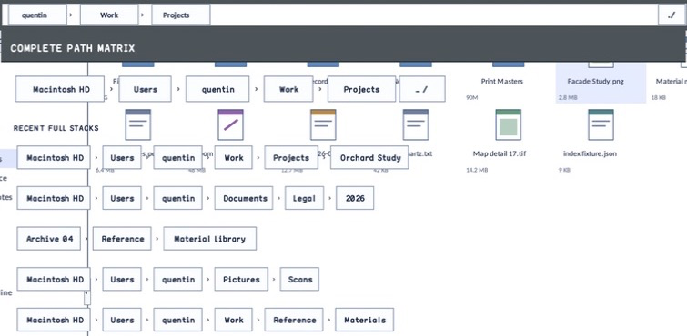

# AnchoredPopupLayer

- Status: **OBSERVED: bundle 005 split; M4 build, focused tests, and Screen Sharing pass**
- Kind: **class / visual retained control**
- Hierarchy: `Panel → AnchoredPopupLayer`
- Declaration: `include/gui_forms/controls/panel/anchored_popup_layer/anchored_popup_layer.hpp:22`
- Definition: `src/controls/panel/anchored_popup_layer/anchored_popup_layer.cpp`

AnchoredPopupLayer is a renderer-neutral retained popup boundary tied to a live anchor. It owns one content control, resolves and updates bounded client-relative geometry, centralizes click-away and Escape dismissal requests, and projects dialog semantics while the Window retains the actual popup lease.

## Visual evidence



## Declared methods

### `AnchoredPopupLayer` (public)

```cpp
AnchoredPopupLayer(StableId stable_id, Control::Ptr anchor, AnchoredPopupPlacement placement =
```

Constructs a full-client popup boundary around a required live anchor and validated placement policy.

### `anchor` (public)

```cpp
[[nodiscard]] Control::Ptr anchor() const noexcept
```

Returns the current strong anchor reference used for geometry and ownership association.

### `set_anchor` (public)

```cpp
void set_anchor(Control::Ptr anchor)
```

Validates and replaces the anchor, then resolves geometry against the next arrangement.

### `content` (public)

```cpp
[[nodiscard]] Control::Ptr content() const noexcept
```

Returns the optional retained control hosted inside the resolved popup bounds.

### `set_content` (public)

```cpp
void set_content(Control::Ptr content)
```

Replaces the single content role with normal parent/attachment bookkeeping and layout invalidation.

### `placement` (public)

```cpp
[[nodiscard]] AnchoredPopupPlacement placement() const noexcept
```

Returns the caller-authored popup geometry policy.

### `set_placement` (public)

```cpp
void set_placement(AnchoredPopupPlacement placement)
```

Validates and commits placement policy, then invalidates geometry and semantics.

### `resolved_placement` (public)

```cpp
[[nodiscard]] AnchoredPopupPlacementResult resolved_placement() const noexcept
```

Returns the last arranged bounds and side/clamping result.

### `dismiss_on_click_away` (public)

```cpp
[[nodiscard]] bool dismiss_on_click_away() const noexcept
```

Reports whether primary presses outside resolved bounds request dismissal.

### `set_dismiss_on_click_away` (public)

```cpp
void set_dismiss_on_click_away(bool enabled)
```

Toggles click-away policy without changing popup ownership.

### `dismiss_on_escape` (public)

```cpp
[[nodiscard]] bool dismiss_on_escape() const noexcept
```

Reports whether Escape preview requests dismissal.

### `set_dismiss_on_escape` (public)

```cpp
void set_dismiss_on_escape(bool enabled)
```

Toggles Escape policy without changing focus or popup leases.

### `dismiss_requested` (public)

```cpp
[[nodiscard]] Event<PopupDismissReason>& dismiss_requested() noexcept
```

Returns the event carrying click-away or Escape reason for the owning coordinator to close.

### `measure` (public)

```cpp
[[nodiscard]] Size measure(Size available) override
```

Consumes the available client boundary while measuring content against preferred popup size.

### `arrange` (public)

```cpp
void arrange(Rect final_bounds) override
```

Resolves placement against live anchor/client geometry and arranges content inside exact bounded results.

### `on_pointer` (public)

```cpp
void on_pointer(PointerEvent& event) override
```

Detects qualified outside primary presses, raises dismissal, and prevents click-through.

### `on_key_preview` (public)

```cpp
void on_key_preview(KeyEvent& event) override
```

Intercepts Escape before descendants when enabled and raises a typed dismissal request.

### `semantic_descriptor` (public)

```cpp
[[nodiscard]] SemanticDescriptor semantic_descriptor() const override
```

Projects a transient dialog boundary with expanded content ownership.

### `validate_anchor` (private)

```cpp
void validate_anchor(const Control::Ptr& anchor) const
```

Reports the current validate anchor value without mutation.
