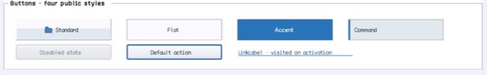

# Button

- Status: **OBSERVED: bundle 002 split; M4 build, focused tests, and Screen Sharing pass**
- Kind: **class / visual retained control**
- Hierarchy: `ButtonBase → Button`
- Declaration: `include/gui_forms/controls/button_base/button/button.hpp:16`
- Definition: `src/controls/button_base/button/button.cpp`

Button specializes ButtonBase with accept/cancel dialog results, default-button state, four public visual policies, bounded flat-border width, and event ordering that commits dialog state before command publication.

## Visual evidence



## Declared methods

### `Button` (public)

```cpp
explicit Button(StableId stable_id, std::string text =
```

Constructs a ButtonBase with standard visual policy and no dialog result.

### `default_button` (public)

```cpp
[[nodiscard]] bool default_button() const noexcept
```

Reports whether Window currently designates this command as the default action.

### `set_default_button` (public)

```cpp
void set_default_button(bool is_default)
```

Commits the default cue and invalidates paint and semantics.

### `dialog_result` (public)

```cpp
[[nodiscard]] DialogResult dialog_result() const noexcept
```

Returns the result assigned to successful activation.

### `set_dialog_result` (public)

```cpp
void set_dialog_result(DialogResult result)
```

Validates the dialog-result vocabulary, commits it, and publishes dialog_result_changed.

### `dialog_result_changed` (public)

```cpp
[[nodiscard]] Event<DialogResult>& dialog_result_changed() noexcept
```

Returns the event published after dialog result commits.

### `visual_style` (public)

```cpp
[[nodiscard]] ButtonVisualStyle visual_style() const noexcept
```

Returns standard, flat, accent, or command presentation policy.

### `set_visual_style` (public)

```cpp
void set_visual_style(ButtonVisualStyle style)
```

Validates the closed visual vocabulary and invalidates size, style, paint, and semantics.

### `flat_border_width` (public)

```cpp
[[nodiscard]] double flat_border_width() const noexcept
```

Returns the explicit flat-style border width.

### `set_flat_border_width` (public)

```cpp
void set_flat_border_width(double width)
```

Accepts a finite bounded width and invalidates painting.

### `on_paint` (public)

```cpp
void on_paint(Painter& painter, Rect local_damage) override
```

Resolves the selected visual role/style and records default/focus/content cues.

### `visual_outsets` (public)

```cpp
[[nodiscard]] Insets visual_outsets() const noexcept override
```

Reports outsets for the active role recipe or compatibility rendering.

### `notify_default` (private)

```cpp
void notify_default(bool value) override
```

Executes Button's notify default operation against retained state; the signature records its exact inputs, result, constness, and failure surface.

### `on_activate` (private)

```cpp
void on_activate() override
```

Runs the control's single authoritative activation path.

### `command_dialog_result` (private)

```cpp
[[nodiscard]] DialogResult command_dialog_result() const noexcept override
```

Reports the current command dialog result value without mutation.

### `assign_cancel_dialog_result` (private)

```cpp
void assign_cancel_dialog_result() override
```

Executes Button's assign cancel dialog result operation against retained state; the signature records its exact inputs, result, constness, and failure surface.
