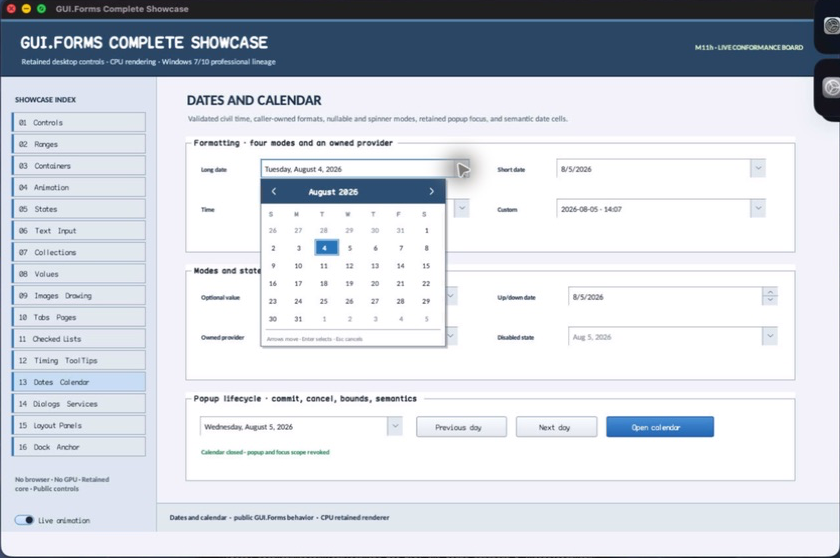

# CalendarPopupLayer

- Status: **OBSERVED: bundle 004 source-private state-machine split; M4 build, focused tests, and Screen Sharing pass**
- Kind: **class / visual retained control**
- Hierarchy: `Panel → CalendarPopupLayer`
- Declaration: `src/controls/panel/date_time_picker/calendar_popup_layer/calendar_popup_layer.hpp:7`
- Definition: `src/controls/panel/date_time_picker/calendar_popup_layer/calendar_popup_layer.cpp`

CalendarPopupLayer is DateTimePicker's source-private transient boundary. It owns outside-click dismissal around the anchored CalendarPopup while leaving date navigation and commit with the popup and picker.

## Visual evidence



## Declared methods

### `CalendarPopupLayer` (public)

```cpp
explicit CalendarPopupLayer(StableId stable_id)
```

Constructs a full-window transient panel around the owned calendar bounds.

### `dismissed` (public)

```cpp
[[nodiscard]] Event<>& dismissed() noexcept
```

Returns the event raised when an outside primary press requests closure.

### `on_pointer` (public)

```cpp
void on_pointer(PointerEvent& event) override
```

Dismisses and consumes a primary press outside the popup, while inside gestures continue to the child.
