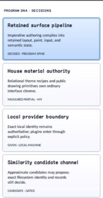

# Card

- Status: **OBSERVED: bundle 001 split; M4 build and focused tests pass**
- Kind: **class / visual retained control**
- Hierarchy: `Panel → Card`
- Declaration: `include/gui_forms/controls/panel/card/card.hpp:32`
- Definition: `src/controls/panel/card/card.cpp`

Card is a retained header/body/footer composition with explicit section ownership, theme-derived or caller-owned layout, optional interaction, selection state, painter-neutral material rendering, and semantic projection.

## Visual evidence



## Declared methods

### `Card` (public)

```cpp
explicit Card(StableId stable_id)
```

Constructs an empty Card and selects the theme's card visual role; sections remain absent until installed.

### `header` (public)

```cpp
[[nodiscard]] Control::Ptr header() const noexcept
```

Returns the currently retained header child, or null when that role is empty.

### `body` (public)

```cpp
[[nodiscard]] Control::Ptr body() const noexcept
```

Returns the currently retained body child, or null when that role is empty.

### `footer` (public)

```cpp
[[nodiscard]] Control::Ptr footer() const noexcept
```

Returns the currently retained footer child, or null when that role is empty.

### `set_header` (public)

```cpp
[[nodiscard]] Control::Ptr set_header(Control::Ptr control)
```

Installs an unparented control in the header role and returns the detached predecessor; cross-role reuse and already-parented controls are rejected atomically.

### `set_body` (public)

```cpp
[[nodiscard]] Control::Ptr set_body(Control::Ptr control)
```

Installs an unparented control in the body role and returns the detached predecessor; ownership and typed invalidation match the other section setters.

### `set_footer` (public)

```cpp
[[nodiscard]] Control::Ptr set_footer(Control::Ptr control)
```

Installs an unparented control in the footer role and returns the detached predecessor; ownership and typed invalidation match the other section setters.

### `card_layout` (public)

```cpp
[[nodiscard]] const CardLayout& card_layout() const noexcept
```

Returns the stored explicit CardLayout value; use effective_card_layout to observe the active theme-derived value.

### `uses_theme_layout` (public)

```cpp
[[nodiscard]] bool uses_theme_layout() const noexcept
```

Reports whether structural spacing and extents currently come from the inherited Theme.

### `effective_card_layout` (public)

```cpp
[[nodiscard]] CardLayout effective_card_layout() const noexcept
```

Resolves either structural Theme tokens or the explicit CardLayout into the active layout contract.

### `set_card_layout` (public)

```cpp
void set_card_layout(CardLayout layout)
```

Validates bounded finite padding, gaps, and extents, then makes the supplied layout authoritative and invalidates measure through semantics.

### `reset_card_layout_to_theme` (public)

```cpp
void reset_card_layout_to_theme()
```

Restores inherited structural Theme tokens as the layout authority.

### `interactive` (public)

```cpp
[[nodiscard]] bool interactive() const noexcept
```

Reports whether the Card participates in hit testing, focus, activation, and selectable item semantics.

### `set_interactive` (public)

```cpp
void set_interactive(bool interactive)
```

Enables or disables interaction, synchronizes focusability, and clears hover/press/focus state when interaction is removed.

### `selected` (public)

```cpp
[[nodiscard]] bool selected() const noexcept
```

Returns the retained selection state.

### `set_selected` (public)

```cpp
void set_selected(bool selected)
```

Commits selection synchronously, invalidates visual and semantic state, then publishes selected_changed once for a real change.

### `selection_behavior` (public)

```cpp
[[nodiscard]] CardSelectionBehavior selection_behavior() const noexcept
```

Returns whether activation leaves selection manual, selects, or toggles selection.

### `set_selection_behavior` (public)

```cpp
void set_selection_behavior(CardSelectionBehavior behavior)
```

Selects an explicit activation/selection policy; invalid enum values are rejected without mutation.

### `hovered_visual` (public)

```cpp
[[nodiscard]] bool hovered_visual() const noexcept
```

Reports the retained hover cue state used by Theme recipe resolution.

### `pressed_visual` (public)

```cpp
[[nodiscard]] bool pressed_visual() const noexcept
```

Reports the retained pointer/keyboard press cue state.

### `focused_visual` (public)

```cpp
[[nodiscard]] bool focused_visual() const noexcept
```

Reports the retained focus cue state.

### `activated` (public)

```cpp
[[nodiscard]] Event<Card&>& activated() noexcept
```

Returns the activation event. When selection behavior is enabled, selection commits before this event is published.

### `selected_changed` (public)

```cpp
[[nodiscard]] Event<bool>& selected_changed() noexcept
```

Returns the selection-change event published after retained selection commits.

### `measure` (public)

```cpp
[[nodiscard]] Size measure(Size available) override
```

Measures current header, body, and footer snapshots defensively, respects mutation during callbacks, and adds only gaps between present sections.

### `arrange` (public)

```cpp
void arrange(Rect final_bounds) override
```

Allocates header from the top, footer from the bottom, and body through the remaining padded extent.

### `on_paint` (public)

```cpp
void on_paint(Painter& painter, Rect local_damage) override
```

Resolves the current card Theme recipe and records its material/focus ring, unless inherited Panel style/background overrides are authoritative.

### `visual_outsets` (public)

```cpp
[[nodiscard]] Insets visual_outsets() const noexcept override
```

Reports compositor outsets from the active material shadows or delegates to Panel when a Panel override is active.

### `hit_test_local` (public)

```cpp
[[nodiscard]] bool hit_test_local(Point local_point) const override
```

Admits local hit testing only while the Card is explicitly interactive.

### `on_pointer` (public)

```cpp
void on_pointer(PointerEvent& event) override
```

Tracks normalized enter/leave and primary-button press/release state; qualified click activation remains the shared Control activation path.

### `on_key` (public)

```cpp
void on_key(KeyEvent& event) override
```

Tracks Space/Enter as a retained press and invokes the same activation path on the matching key release.

### `on_focus_changed` (public)

```cpp
void on_focus_changed(bool focused) override
```

Commits the focus cue and cancels incomplete keyboard presses when focus leaves.

### `on_activate` (public)

```cpp
void on_activate() override
```

Applies the configured selection behavior, then publishes activated if the selection callback did not dispose the Card.

### `semantic_descriptor` (public)

```cpp
[[nodiscard]] SemanticDescriptor semantic_descriptor() const override
```

Projects an interactive Card as a selectable list item and carries selected, busy, or invalid state into the semantic graph.

### `on_semantic_action` (public)

```cpp
bool on_semantic_action(SemanticAction action, std::string_view value) override
```

Routes semantic press through activation, semantic select through retained selection, and delegates unrelated actions to Panel.

### `replace_section` (private)

```cpp
Control::Ptr replace_section(Control::Ptr& slot, Control::Ptr replacement)
```

Executes Card's replace section operation against retained state; the signature records its exact inputs, result, constness, and failure surface.

### `current_context` (private)

```cpp
[[nodiscard]] ControlVisualContext current_context() const noexcept
```

Reports the current current context value without mutation.
