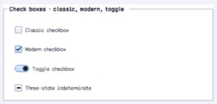

# CheckBox

- Status: **OBSERVED: bundle 002 split; M4 build, focused tests, and Screen Sharing pass**
- Kind: **class / visual retained control**
- Hierarchy: `ButtonBase → CheckBox`
- Declaration: `include/gui_forms/controls/button_base/check_box/check_box.hpp:15`
- Definition: `src/controls/button_base/check_box/check_box.cpp`

CheckBox specializes ButtonBase with validated two/three-state selection, optional automatic cycling, three indicator families, ordered state events, and checkable semantics.

## Visual evidence



## Declared methods

### `CheckBox` (public)

```cpp
explicit CheckBox(StableId stable_id, std::string text =
```

Constructs an auto-checking unchecked command with classic indicator policy.

### `check_state` (public)

```cpp
[[nodiscard]] CheckState check_state() const noexcept
```

Returns unchecked, checked, or indeterminate retained state.

### `set_check_state` (public)

```cpp
void set_check_state(CheckState state)
```

Validates state and three-state policy, commits it, then publishes state and boolean changes in order.

### `checked` (public)

```cpp
[[nodiscard]] bool checked() const noexcept
```

Maps retained state to true only for the checked value.

### `set_checked` (public)

```cpp
void set_checked(bool checked)
```

Selects checked or unchecked through the authoritative check-state setter.

### `three_state` (public)

```cpp
[[nodiscard]] bool three_state() const noexcept
```

Reports whether indeterminate is admitted and activation cycles three values.

### `set_three_state` (public)

```cpp
void set_three_state(bool enabled)
```

Toggles three-state policy and normalizes an existing indeterminate value when disabling it.

### `auto_check` (public)

```cpp
[[nodiscard]] bool auto_check() const noexcept
```

Reports whether activation mutates check state before command publication.

### `set_auto_check` (public)

```cpp
void set_auto_check(bool enabled)
```

Enables or disables automatic state cycling.

### `indicator_style` (public)

```cpp
[[nodiscard]] ChoiceIndicatorStyle indicator_style() const noexcept
```

Returns classic box, modern box, or toggle-switch presentation.

### `set_indicator_style` (public)

```cpp
void set_indicator_style(ChoiceIndicatorStyle style)
```

Validates indicator vocabulary and invalidates size, paint, and semantics.

### `check_state_changed` (public)

```cpp
[[nodiscard]] Event<CheckState>& check_state_changed() noexcept
```

Returns the event published after the complete CheckState commits.

### `checked_changed` (public)

```cpp
[[nodiscard]] Event<bool>& checked_changed() noexcept
```

Returns the boolean projection event published when checkedness changes.

### `on_paint` (public)

```cpp
void on_paint(Painter& painter, Rect local_damage) override
```

Records the selected indicator family, content, focus, and disabled states.

### `visual_outsets` (public)

```cpp
[[nodiscard]] Insets visual_outsets() const noexcept override
```

Reports theme material outsets for modern/toggle rendering where applicable.

### `on_activate` (public)

```cpp
void on_activate() override
```

Cycles state when auto-checking, stops safely after disposal, then publishes the inherited click.

### `semantic_descriptor` (public)

```cpp
[[nodiscard]] SemanticDescriptor semantic_descriptor() const override
```

Projects checkbox role, check state including mixed, and press/toggle behavior.
