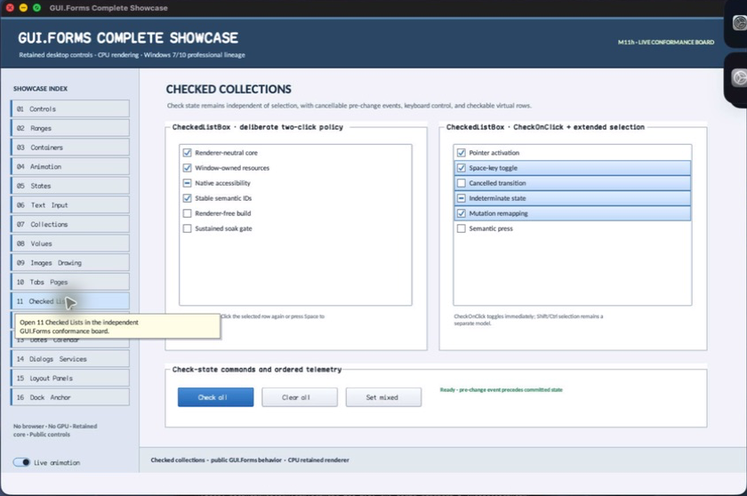

# CheckedListBox

- Status: **OBSERVED: bundle 004 split and indicator-size enhancement; M4 build, focused tests, and Screen Sharing pass**
- Kind: **class / visual retained control**
- Hierarchy: `ListBox → CheckedListBox`
- Declaration: `include/gui_forms/controls/panel/list_box/checked_list_box/checked_list_box.hpp:20`
- Definition: `src/controls/panel/list_box/checked_list_box/checked_list_box.cpp`

CheckedListBox extends ListBox with an independently retained three-state check model, cancellable pre-change events, committed change events, optional check-on-click, configurable indicator geometry, and checkable virtual semantics.

## Visual evidence



## Declared methods

### `CheckedListBox` (public)

```cpp
explicit CheckedListBox(StableId stable_id)
```

Constructs a ListBox with parallel check-state storage and checkable semantics.

### `set_items` (public)

```cpp
void set_items(std::vector<std::string> items) override
```

Replaces rows while preserving inherited collection laws and resizes check state coherently.

### `add_item` (public)

```cpp
void add_item(std::string item) override
```

Appends an item with unchecked or explicitly supplied state through one synchronized collection path.

### `add_item` (public)

```cpp
void add_item(std::string item, CheckState state)
```

Appends an item with unchecked or explicitly supplied state through one synchronized collection path.

### `remove_item` (public)

```cpp
void remove_item(std::size_t index) override
```

Removes the row and its corresponding check state while preserving index alignment.

### `clear_items` (public)

```cpp
void clear_items() override
```

Clears inherited rows and all retained check states.

### `item_check_state` (public)

```cpp
[[nodiscard]] CheckState item_check_state(std::size_t index) const
```

Returns the validated row's unchecked, checked, or indeterminate state.

### `item_checked` (public)

```cpp
[[nodiscard]] bool item_checked(std::size_t index) const
```

Reports whether the row is specifically in the checked state.

### `set_item_check_state` (public)

```cpp
void set_item_check_state(std::size_t index, CheckState state)
```

Validates state/index, permits cancellation, commits the real change, and publishes the completed transition.

### `set_item_checked` (public)

```cpp
void set_item_checked(std::size_t index, bool checked)
```

Maps a Boolean request to unchecked/checked through the common state transition.

### `toggle_item` (public)

```cpp
void toggle_item(std::size_t index)
```

Cycles unchecked to checked, and any nonzero state to unchecked, through cancellable change logic.

### `checked_indices` (public)

```cpp
[[nodiscard]] std::vector<std::size_t> checked_indices() const
```

Returns indexes whose state is specifically checked.

### `check_on_click` (public)

```cpp
[[nodiscard]] bool check_on_click() const noexcept
```

Reports whether a row click toggles immediately or requires clicking the indicator/selected row again.

### `set_check_on_click` (public)

```cpp
void set_check_on_click(bool enabled)
```

Commits the click qualification policy and invalidates semantics.

### `indicator_size` (public)

```cpp
[[nodiscard]] double indicator_size() const noexcept
```

Returns the logical square check-indicator extent.

### `set_indicator_size` (public)

```cpp
void set_indicator_size(double size)
```

Accepts a finite 8–32 logical-pixel size and updates row text inset and painting.

### `item_checking` (public)

```cpp
[[nodiscard]] Event<ItemCheckEvent&>& item_checking() noexcept
```

Returns the cancellable event published before a check-state transition.

### `item_check_state_changed` (public)

```cpp
[[nodiscard]] Event<std::size_t, CheckState>& item_check_state_changed() noexcept
```

Returns the event published after a check-state transition commits.

### `on_pointer` (public)

```cpp
void on_pointer(PointerEvent& event) override
```

Coordinates inherited row selection with indicator-aware check toggling.

### `on_key` (public)

```cpp
void on_key(KeyEvent& event) override
```

Lets Space toggle the active row and delegates navigation/activation to ListBox.

### `semantic_virtual_children` (public)

```cpp
[[nodiscard]] std::vector<SemanticNode> semantic_virtual_children() const override
```

Augments inherited row nodes with checked/mixed state and toggle actions.

### `on_semantic_child_action` (public)

```cpp
bool on_semantic_child_action(std::string_view stable_id, SemanticAction action, std::string_view value) override
```

Routes toggle actions to check state and other actions to inherited list behavior.

### `row_text_left` (protected)

```cpp
[[nodiscard]] double row_text_left() const noexcept override
```

Reports the current row text left value without mutation.

### `paint_row_adornment` (protected)

```cpp
void paint_row_adornment(Painter& painter, std::size_t index, Rect row_bounds, bool selected, bool focused) const override
```

Reports the current paint row adornment value without mutation.
