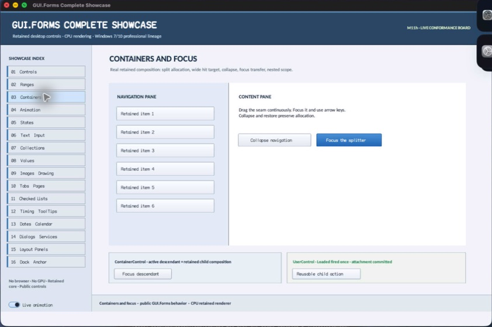

# ContainerControl

- Status: **OBSERVED: bundle 003 split; M4 build, focused tests, and Screen Sharing pass**
- Kind: **class / visual retained control**
- Hierarchy: `ScrollableControl → ContainerControl`
- Declaration: `include/gui_forms/controls/scrollable_control/container_control/container_control.hpp:7`
- Definition: `src/controls/scrollable_control/container_control/container_control.cpp`

ContainerControl adds descendant-scoped active-control authority and inherited validation policy to ScrollableControl, making focus and validation explicit retained container state rather than incidental child behavior.

## Visual evidence



## Declared methods

### `ContainerControl` (public)

```cpp
explicit ContainerControl(StableId stable_id)
```

Constructs a scroll-capable semantic group with inherited automatic-validation policy.

### `contains_descendant` (public)

```cpp
[[nodiscard]] bool contains_descendant(const Control::Ptr& control) const noexcept
```

Reports whether a live control belongs below this container, excluding unrelated trees.

### `active_control` (public)

```cpp
[[nodiscard]] Control::Ptr active_control() const noexcept
```

Returns the live focused/activated descendant recorded for this scope, or null when none remains.

### `request_active_control` (public)

```cpp
bool request_active_control(const Control::Ptr& control)
```

Validates descendant membership, runs focus/validation gates, and asks the attached Window to establish focus before committing scope state.

### `clear_active_control` (public)

```cpp
bool clear_active_control()
```

Clears the scope's active descendant and relinquishes Window focus when that descendant owns it.

### `auto_validate` (public)

```cpp
[[nodiscard]] AutoValidate auto_validate() const noexcept
```

Returns the authored inherit/enable/disable validation policy.

### `effective_auto_validate` (public)

```cpp
[[nodiscard]] AutoValidate effective_auto_validate() const noexcept
```

Walks the container ancestry to resolve inherited validation policy to an operative value.

### `set_auto_validate` (public)

```cpp
void set_auto_validate(AutoValidate value)
```

Validates the closed policy vocabulary, commits a real change, and publishes auto_validate_changed.

### `auto_validate_changed` (public)

```cpp
[[nodiscard]] Event<AutoValidate>& auto_validate_changed() noexcept
```

Returns the event published after authored validation policy commits.

### `validate` (public)

```cpp
bool validate(bool check_auto_validate = false)
```

Validates this container and optionally honors the resolved automatic-validation policy.

### `validate_children` (public)

```cpp
bool validate_children( ValidationConstraints constraints = ValidationConstraints::selectable)
```

Traverses stable child snapshots and validates descendants matching the supplied constraints, tolerating mutation and disposal.

### `semantic_descriptor` (public)

```cpp
[[nodiscard]] SemanticDescriptor semantic_descriptor() const override
```

Projects an optional group role and current validation/focus state over the inherited scrollable descriptor.

### `authored_auto_validate` (private)

```cpp
[[nodiscard]] AutoValidate authored_auto_validate() const noexcept override
```

Reports the current authored auto validate value without mutation.
