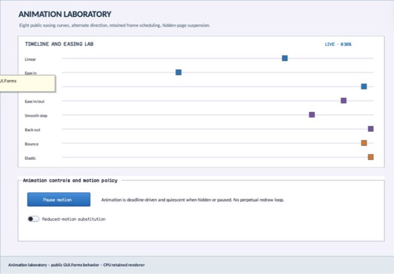

# EasingPreview

- Status: **OBSERVED: bundle 006 split and marker-size enhancement; M4 build, focused tests, and Screen Sharing pass**
- Kind: **class / visual retained control**
- Hierarchy: `Control → EasingPreview`
- Declaration: `include/gui_forms/controls/easing_preview/easing_preview.hpp:21`
- Definition: `src/controls/easing_preview/easing_preview.cpp`

EasingPreview is a retained animation conformance surface that owns an AnimationTimeline, one revocable frame lease, configurable tracks/style/title/marker size, authored and effective motion policy, deterministic phase, painter recording, and image semantics. Hidden, detached, paused, or reduced states never create a perpetual redraw loop.

## Visual evidence



## Declared methods

### `EasingPreview` (public)

```cpp
explicit EasingPreview(StableId stable_id)
```

Constructs the canonical eight-curve infinite timeline and accessible conformance description.

### `title` (public)

```cpp
[[nodiscard]] const std::string& title() const noexcept
```

Returns the retained heading.

### `set_title` (public)

```cpp
void set_title(std::string title)
```

Commits heading and refreshes paint and semantics.

### `style` (public)

```cpp
[[nodiscard]] const BasicControlStyle& style() const noexcept
```

Returns the retained visual palette.

### `set_style` (public)

```cpp
void set_style(BasicControlStyle style)
```

Commits palette without changing timeline authority.

### `specification` (public)

```cpp
[[nodiscard]] const AnimationSpec& specification() const noexcept
```

Returns the authoritative AnimationTimeline specification.

### `set_specification` (public)

```cpp
void set_specification(AnimationSpec specification)
```

Validates through AnimationTimeline, restarts/preserves policy coherently, and reconciles the frame lease.

### `tracks` (public)

```cpp
[[nodiscard]] const std::vector<EasingPreviewTrack>& tracks() const noexcept
```

Returns ordered curve/label/color track configuration.

### `set_tracks` (public)

```cpp
void set_tracks(std::vector<EasingPreviewTrack> tracks)
```

Requires one through 32 named tracks and refreshes paint and semantics.

### `motion_policy` (public)

```cpp
[[nodiscard]] MotionPolicy motion_policy() const noexcept
```

Returns the caller-authored enabled/paused/reduced policy.

### `effective_motion_policy` (public)

```cpp
[[nodiscard]] MotionPolicy effective_motion_policy() const noexcept
```

Combines authored policy with Window reduced-motion presentation settings.

### `set_motion_policy` (public)

```cpp
void set_motion_policy(MotionPolicy policy)
```

Commits policy, pauses/resumes without catch-up, and acquires or revokes the single frame lease.

### `marker_size` (public)

```cpp
[[nodiscard]] double marker_size() const noexcept
```

Returns the logical square marker size.

### `set_marker_size` (public)

```cpp
void set_marker_size(double size)
```

Validates a size within [4, 48] and refreshes track paint.

### `phase` (public)

```cpp
[[nodiscard]] double phase() const noexcept
```

Returns the last retained normalized timeline phase.

### `on_frame` (public)

```cpp
void on_frame(FrameTime now) override
```

Samples active timeline state, updates phase, and disconnects when a finite animation finishes.

### `on_paint` (public)

```cpp
void on_paint(Painter& painter, Rect local_damage) override
```

Records frame, title/readout, each track, and curve-sampled markers from effective motion policy.

### `hit_test_local` (public)

```cpp
[[nodiscard]] bool hit_test_local(Point local_point) const override
```

Always rejects input because surrounding controls own policy interaction.

### `semantic_descriptor` (public)

```cpp
[[nodiscard]] SemanticDescriptor semantic_descriptor() const override
```

Projects image role, normalized phase/range, motion readout, and busy state only while active.

### `on_attached_to_window` (protected)

```cpp
void on_attached_to_window() override
```

Public EasingPreview operation. Its exact signature is inventoried here; follow the linked implementation for callback order and failure behavior.

### `on_detached_from_window` (protected)

```cpp
void on_detached_from_window() noexcept override
```

Public EasingPreview operation. Its exact signature is inventoried here; follow the linked implementation for callback order and failure behavior.

### `register_frames` (private)

```cpp
void register_frames()
```

Public EasingPreview operation. Its exact signature is inventoried here; follow the linked implementation for callback order and failure behavior.

### `motion_readout` (private)

```cpp
[[nodiscard]] std::string motion_readout(double presented_phase) const
```

Reports the current motion readout value without mutation.
