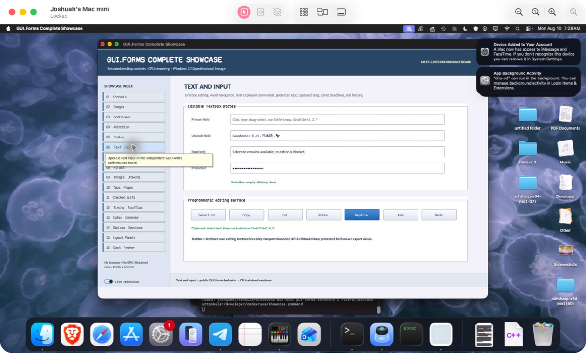

# FieldControl

- Status: **OBSERVED: bundle 013 per-adapter Unicode field state-machine isolation; native and MinGW ABI builds pass**
- Kind: **class / visual retained control**
- Hierarchy: `Panel → FieldControl`
- Declaration: `src/abi/control_adapters/field_control/field_control.hpp:11`
- Definition: `src/abi/control_adapters/field_control/field_control.cpp`

FieldControl owns compatibility text/list/combo/numeric field editing without importing managed runtime state: validated Unicode selection, directional navigation, history, geometry, hit testing, clipping, and viewport remain native.

## Visual evidence



## Declared methods

### `~FieldControl` (public)

```cpp
~FieldControl() override
```

Releases field text, history, shaping, and event state through its isolated translation-unit boundary.

### `FieldControl` (public)

```cpp
FieldControl(StableId stable_id, FieldControlKind kind) : Panel(std::move(stable_id)), kind_(kind)
```

Constructs one closed field kind and stable retained panel identity.

### `set_colors` (public)

```cpp
void set_colors(gui_forms::Color foreground, gui_forms::Color background)
```

Commits explicit foreground/background compatibility colors.

### `set_text` (public)

```cpp
void set_text(std::string text)
```

Validates UTF-8, snapshots history, replaces content, clamps selection, and invalidates retained presentation.

### `replace` (public)

```cpp
[[nodiscard]] bool replace(std::uint64_t start, std::uint64_t length, std::string_view replacement, gf_field_edit_result& result)
```

Validates a byte range and replacement, applies edit policy/history, and returns exact edit telemetry.

### `history` (public)

```cpp
[[nodiscard]] bool history(std::int32_t direction, gf_field_edit_result& result)
```

Moves backward or forward through bounded snapshots.

### `clear_history` (public)

```cpp
void clear_history() noexcept
```

Drops undo and redo stacks.

### `text` (public)

```cpp
[[nodiscard]] std::string_view text() const noexcept
```

Returns current UTF-8 content.

### `set_selection` (public)

```cpp
bool set_selection(std::uint64_t start, std::uint64_t length, bool caret_visible)
```

Validates scalar boundaries and commits anchor/caret direction.

### `set_edit_state` (public)

```cpp
bool set_edit_state(std::uint64_t anchor, std::uint64_t caret, bool caret_visible)
```

Commits read-only, password, multiline, and viewport state after validation.

### `position_at` (public)

```cpp
[[nodiscard]] std::uint64_t position_at(double local_x) const noexcept
```

Maps local x through shaped glyph geometry and viewport to a scalar boundary.

### `navigate` (public)

```cpp
[[nodiscard]] bool navigate(std::uint64_t position, std::int32_t direction, std::uint64_t& result) const noexcept
```

Moves or extends the selection through the requested Unicode navigation operation.

### `on_paint` (public)

```cpp
void on_paint(gui_forms::Painter& painter, Rect damage) override
```

Paints the compatibility field, selection, caret, masked text, border, and clipping through retained Painter vocabulary.

### `on_focus_changed` (public)

```cpp
void on_focus_changed(bool focused) override
```

Invalidates caret/focus presentation.

### `pointer_input` (public)

```cpp
[[nodiscard]] gui_forms::Event<const RasterPointerSample&>& pointer_input() noexcept
```

Returns compatibility pointer observation.

### `key_input` (public)

```cpp
[[nodiscard]] gui_forms::Event<const RasterKeySample&>& key_input() noexcept
```

Returns compatibility key observation.

### `text_input` (public)

```cpp
[[nodiscard]] gui_forms::Event<const RasterTextSample&>& text_input() noexcept
```

Returns compatibility text observation.

### `on_pointer` (public)

```cpp
void on_pointer(gui_forms::PointerEvent& event) override
```

Projects pointer events, performs hit-test caret placement, and publishes the sample.

### `on_key` (public)

```cpp
void on_key(gui_forms::KeyEvent& event) override
```

Projects keys, applies navigation/editing when unhandled, and copies handled state.

### `on_text_input` (public)

```cpp
void on_text_input(gui_forms::TextInputEvent& event) override
```

Projects composition/replacement input and commits admitted edits.

### `snapshot` (private)

```cpp
[[nodiscard]] FieldSnapshot snapshot() const
```

Captures exact edit/history state.

### `apply_snapshot` (private)

```cpp
void apply_snapshot(FieldSnapshot snapshot)
```

Restores a snapshot with validation and retained invalidation.

### `push_history` (private)

```cpp
void push_history(std::deque<FieldSnapshot>& history, FieldSnapshot snapshot)
```

Adds a bounded snapshot while suppressing duplicate adjacent states.

### `push_undo` (private)

```cpp
void push_undo(FieldSnapshot snapshot)
```

Captures pre-edit state and clears forward history.

### `clear_redo` (private)

```cpp
void clear_redo() noexcept
```

Drops redo state after divergent edits.

### `edit_result` (private)

```cpp
[[nodiscard]] gf_field_edit_result edit_result(bool changed) const noexcept
```

Builds exact ABI edit telemetry from old/new state.
