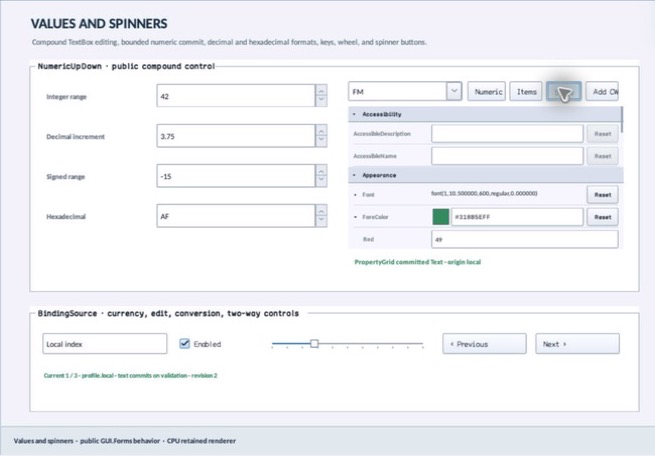

# FlagsValueEditor

- Status: **OBSERVED: bundle 006 split and popup-width enhancement; M4 build, focused tests, and Screen Sharing pass**
- Kind: **class / visual retained control**
- Hierarchy: `Panel → FlagsValueEditor`
- Declaration: `include/gui_forms/controls/panel/flags_value_editor/flags_value_editor.hpp:11`
- Definition: `src/controls/panel/flags_value_editor/flags_value_editor.cpp`

FlagsValueEditor is a compact retained editor for independent-bit enumeration values. It validates descriptor/value membership, formats canonical names, owns a source-private dismissal layer and real CheckedListBox popup under Window popup/focus-scope leases, synchronizes checks without feedback, commits typed values immediately, and exposes configurable popup width.

## Visual evidence



## Declared methods

### `FlagsValueEditor` (public)

```cpp
FlagsValueEditor(StableId stable_id, PropertyEnumDescriptor descriptor, PropertyEnumValue value)
```

Constructs a focusable sunken flags field and validates initial descriptor/value.

### `descriptor` (public)

```cpp
[[nodiscard]] const PropertyEnumDescriptor& descriptor() const noexcept
```

Returns the authoritative flags enumeration descriptor.

### `set_descriptor` (public)

```cpp
void set_descriptor(PropertyEnumDescriptor descriptor)
```

Validates flags topology and reconciles current value, popup checks, paint, and semantics.

### `value` (public)

```cpp
[[nodiscard]] const PropertyEnumValue& value() const noexcept
```

Returns the current typed PropertyEnumValue.

### `set_value` (public)

```cpp
void set_value(PropertyEnumValue value)
```

Normalizes against the descriptor, commits a distinct typed value, and synchronizes an open popup without user feedback.

### `dropped_down` (public)

```cpp
[[nodiscard]] bool dropped_down() const noexcept
```

Reports whether the editor owns a connected popup/focus-scope lease.

### `set_dropped_down` (public)

```cpp
void set_dropped_down(bool dropped_down)
```

Opens or closes through the common transient ownership state machine.

### `popup_width` (public)

```cpp
[[nodiscard]] double popup_width() const noexcept
```

Returns preferred logical width for the checked-list popup.

### `set_popup_width` (public)

```cpp
void set_popup_width(double width)
```

Validates [80, 1024] and rebuilds an open popup against client bounds.

### `value_changed` (public)

```cpp
[[nodiscard]] Event<const PropertyEnumValue&>& value_changed() noexcept
```

Returns the event published after a typed flags commit.

### `drop_down_changed` (public)

```cpp
[[nodiscard]] Event<bool>& drop_down_changed() noexcept
```

Returns the event published after transient ownership opens or closes.

### `on_paint` (public)

```cpp
void on_paint(Painter& painter, Rect local_damage) override
```

Records field frame, canonical flags text, disclosure affordance, focus, and invalid state.

### `on_pointer` (public)

```cpp
void on_pointer(PointerEvent& event) override
```

Qualifies primary field activation and opens/closes the popup.

### `on_key` (public)

```cpp
void on_key(KeyEvent& event) override
```

Handles disclosure, commit navigation, and Escape closure.

### `on_focus_changed` (public)

```cpp
void on_focus_changed(bool focused) override
```

Commits focus appearance independently of popup lifetime.

### `semantic_descriptor` (public)

```cpp
[[nodiscard]] SemanticDescriptor semantic_descriptor() const override
```

Projects combo-box role, canonical typed value, expanded/invalid state, and actions.

### `on_semantic_action` (public)

```cpp
bool on_semantic_action(SemanticAction action, std::string_view value) override
```

Maps press/expand/collapse to normal transient state changes.

### `on_detached_from_window` (protected)

```cpp
void on_detached_from_window() noexcept override
```

Public FlagsValueEditor operation. Its exact signature is inventoried here; follow the linked implementation for callback order and failure behavior.

### `open_drop_down` (private)

```cpp
void open_drop_down()
```

Public FlagsValueEditor operation. Its exact signature is inventoried here; follow the linked implementation for callback order and failure behavior.

### `close_drop_down` (private)

```cpp
void close_drop_down()
```

Public FlagsValueEditor operation. Its exact signature is inventoried here; follow the linked implementation for callback order and failure behavior.

### `on_popup_revoked` (private)

```cpp
void on_popup_revoked()
```

Public FlagsValueEditor operation. Its exact signature is inventoried here; follow the linked implementation for callback order and failure behavior.

### `synchronize_popup` (private)

```cpp
void synchronize_popup()
```

Public FlagsValueEditor operation. Its exact signature is inventoried here; follow the linked implementation for callback order and failure behavior.

### `apply_popup_choice` (private)

```cpp
void apply_popup_choice(std::size_t popup_index, CheckState state)
```

Public FlagsValueEditor operation. Its exact signature is inventoried here; follow the linked implementation for callback order and failure behavior.
