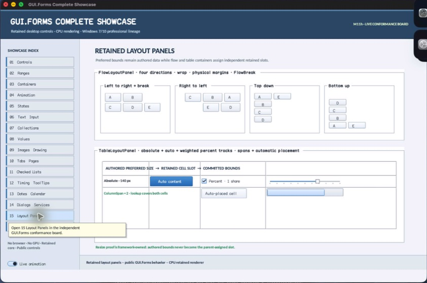

# FlowLayoutPanel

- Status: **OBSERVED: bundle 003 split and item-spacing enhancement; M4 build, focused tests, and Screen Sharing pass**
- Kind: **class / visual retained control**
- Hierarchy: `ContainerControl → FlowLayoutPanel`
- Declaration: `include/gui_forms/controls/scrollable_control/container_control/flow_layout_panel/flow_layout_panel.hpp:17`
- Definition: `src/controls/scrollable_control/container_control/flow_layout_panel/flow_layout_panel.cpp`

FlowLayoutPanel is a retained directional packing algorithm with four flow directions, optional wrapping, explicit bounded inter-item/inter-line spacing, per-child margins, stable flow breaks, and optional content-driven size.

## Visual evidence



## Declared methods

### `FlowLayoutPanel` (public)

```cpp
explicit FlowLayoutPanel(StableId stable_id)
```

Constructs a left-to-right wrapping ContainerControl with zero explicit inter-item spacing.

### `flow_direction` (public)

```cpp
[[nodiscard]] FlowDirection flow_direction() const noexcept
```

Returns left-to-right, right-to-left, top-down, or bottom-up packing order.

### `set_flow_direction` (public)

```cpp
void set_flow_direction(FlowDirection direction)
```

Validates the closed direction vocabulary and invalidates measurement, arrangement, and semantics.

### `wrap_contents` (public)

```cpp
[[nodiscard]] bool wrap_contents() const noexcept
```

Reports whether overflowing items start a new line or column.

### `set_wrap_contents` (public)

```cpp
void set_wrap_contents(bool wrap)
```

Toggles wrapping and invalidates the retained layout result.

### `item_spacing` (public)

```cpp
[[nodiscard]] Size item_spacing() const noexcept
```

Returns explicit main-axis item and cross-axis line separation as logical dimensions.

### `set_item_spacing` (public)

```cpp
void set_item_spacing(Size spacing)
```

Accepts finite zero-to-256 spacing, applies it between items and lines without trailing gaps, and invalidates layout.

### `auto_size` (public)

```cpp
[[nodiscard]] bool auto_size() const noexcept override
```

Returns whether desired size follows the packed child extent.

### `set_auto_size` (public)

```cpp
void set_auto_size(bool auto_size) override
```

Commits content-driven sizing through the base Control property while preserving flow-specific invalidation.

### `set_flow_break` (public)

```cpp
void set_flow_break(const Control& child, bool flow_break)
```

Requires a direct child and records whether it terminates the current line/column after itself.

### `flow_break` (public)

```cpp
[[nodiscard]] bool flow_break(const Control& child) const
```

Returns the retained break bit for a current direct child.

### `measure` (public)

```cpp
[[nodiscard]] Size measure(Size available) override
```

Packs stable child snapshots without assignment and returns the bounded flow extent when auto-sized.

### `arrange` (public)

```cpp
void arrange(Rect final_bounds) override
```

Reconciles removed metadata and assigns each live child a margin-aware directional slot in final bounds.

### `semantic_descriptor` (public)

```cpp
[[nodiscard]] SemanticDescriptor semantic_descriptor() const override
```

Projects a named flow surface as a group while leaving unnamed structural layout unexposed.

### `layout_children` (private)

```cpp
[[nodiscard]] Size layout_children(Size available, bool assign)
```

Public FlowLayoutPanel operation. Its exact signature is inventoried here; follow the linked implementation for callback order and failure behavior.

### `reconcile_flow_breaks` (private)

```cpp
void reconcile_flow_breaks()
```

Public FlowLayoutPanel operation. Its exact signature is inventoried here; follow the linked implementation for callback order and failure behavior.
