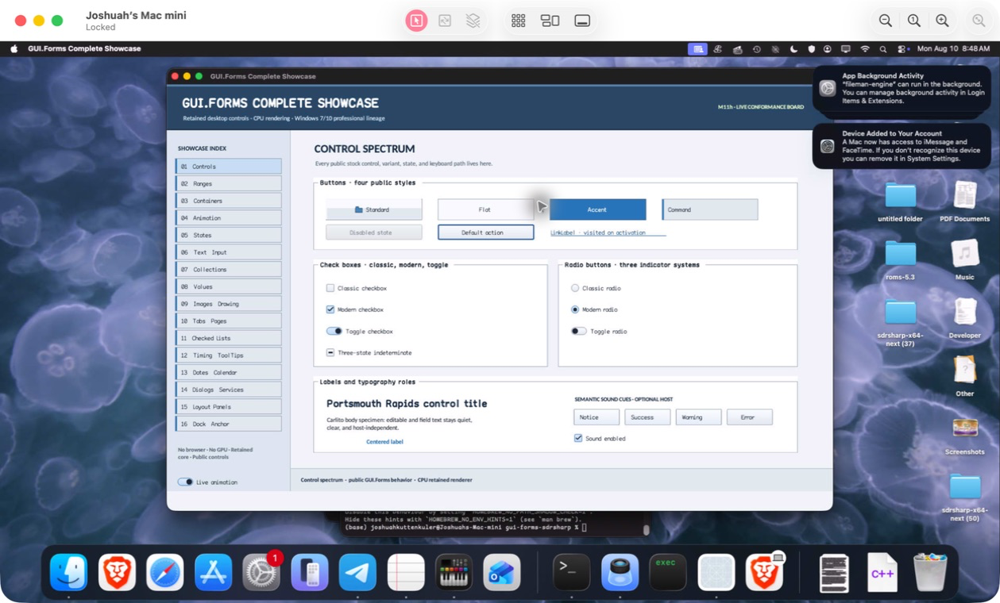

# FormControl

- Status: **OBSERVED: bundle 013 per-adapter source isolation; native and MinGW ABI builds pass**
- Kind: **class / visual retained control**
- Hierarchy: `Panel → FormControl`
- Declaration: `src/abi/control_adapters/form_control/form_control.hpp:11`
- Definition: `src/abi/control_adapters/form_control/form_control.cpp`

FormControl is a retained Panel with a pre-focused-child key-preview bridge kept inside the compatibility adapter.

## Visual evidence



## Declared methods

### `~FormControl` (public)

```cpp
~FormControl() override
```

Releases form-preview state through its isolated translation-unit boundary.

### `FormControl` (public)

```cpp
explicit FormControl(StableId stable_id) : Panel(std::move(stable_id))
```

Constructs the retained panel surface.

### `key_preview` (public)

```cpp
[[nodiscard]] gui_forms::Event<RasterKeySample&>& key_preview() noexcept
```

Returns mutable compatibility key-preview observation.

### `on_key_preview` (public)

```cpp
void on_key_preview(gui_forms::KeyEvent& event) override
```

Projects a core key event, emits preview, and copies handled state back.
