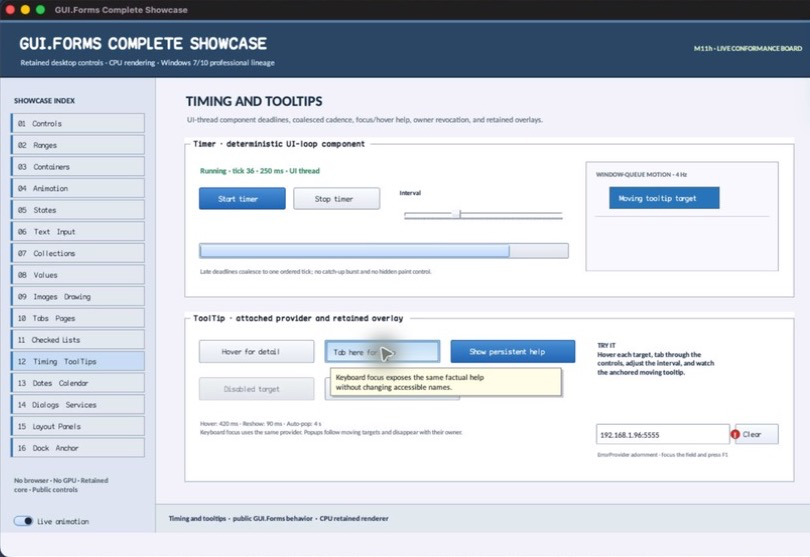

# HelpProviderSnapshot

- Status: **OBSERVED: bundle 005 diagnostic value split; M4 build, focused tests, and Screen Sharing pass**
- Kind: **struct**
- Hierarchy: `HelpProviderSnapshot`
- Declaration: `include/gui_forms/components/help_provider/help_provider.hpp:50`
- Definition: `inline/header-only`

HelpProviderSnapshot is a deterministic diagnostic aggregate of authored mappings, effective mappings, total requests, and handled requests.

## Visual evidence

## Declared methods

No public methods were discovered in this declaration.
