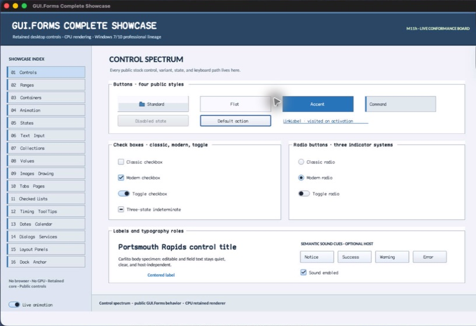

# HostServices

- Status: **OBSERVED: bundle 007 portable service state-machine split and coalescing customization; M4 macOS/MinGW builds and focused tests pass**
- Kind: **class**
- Hierarchy: `HostServices`
- Declaration: `include/gui_forms/host/services/host_services.hpp:14`
- Definition: `src/core/host/services/host_services.cpp`

HostServices centralizes portable thread, capability, UTF-8, size, modal-stack, semantic-sound, accounting, adapter-fault, and shutdown policy. Platform implementations provide only native operations, so behavioral gates remain identical headlessly, on AppKit, and on Win32.

## Visual evidence



## Declared methods

### `HostServices` (public)

```cpp
explicit HostServices(HostCapabilities capabilities)
```

Binds immutable UI-thread affinity and seeds the capability snapshot; copying is prohibited.

### `~HostServices` (public)

```cpp
virtual ~HostServices() = default
```

Destroys the abstract service state after the concrete adapter has shut down.

### `HostServices` (public)

```cpp
HostServices(const HostServices&) = delete
```

Binds immutable UI-thread affinity and seeds the capability snapshot; copying is prohibited.

### `operator=` (public)

```cpp
HostServices& operator=(const HostServices&) = delete
```

Is deleted because UI affinity, modal stack, and backend ownership are singular.

### `query_monitors` (public)

```cpp
[[nodiscard]] HostMonitorResult query_monitors()
```

Validates capability/thread/lifetime, calls the adapter, validates a unique-primary geometry set, and accounts the result.

### `set_cursor` (public)

```cpp
[[nodiscard]] HostServiceStatus set_cursor(CursorKind cursor)
```

Validates a defined cursor, delegates native mapping, and commits snapshot state only on success.

### `set_pointer_capture` (public)

```cpp
[[nodiscard]] HostServiceStatus set_pointer_capture( bool captured, std::uint64_t pointer_id = 1)
```

Validates pointer identity and capability, delegates native capture, and commits exact captured state only on success.

### `read_clipboard_text` (public)

```cpp
[[nodiscard]] HostClipboardTextResult read_clipboard_text()
```

Validates service policy, delegates native read, enforces UTF-8/size/generation rules, and accounts failures.

### `write_clipboard_text` (public)

```cpp
[[nodiscard]] HostServiceStatus write_clipboard_text( std::string_view text_utf8)
```

Validates UTF-8, NUL exclusion, size, thread, capability, and lifetime before native publication.

### `show_dialog` (public)

```cpp
[[nodiscard]] HostDialogResult show_dialog( const HostDialogRequest& request)
```

Validates typed request/result topology, enforces unique IDs and bounded modal nesting, publishes enter/leave transitions, contains adapter faults, and accounts acceptance/cancellation.

### `play_sound_cue` (public)

```cpp
[[nodiscard]] HostServiceStatus play_sound_cue( const HostSoundCueRequest& request)
```

Validates semantic cue/gain/monotonic time, applies configurable same-cue burst coalescing and mute policy, delegates native playback, and accounts every outcome.

### `sound_cue_coalescing_window` (public)

```cpp
[[nodiscard]] std::chrono::nanoseconds sound_cue_coalescing_window() const noexcept
```

Returns the current semantic-cue burst window; the default is 50 ms.

### `set_sound_cue_coalescing_window` (public)

```cpp
[[nodiscard]] HostServiceStatus set_sound_cue_coalescing_window( std::chrono::nanoseconds window)
```

Validates zero through five seconds, commits the new policy, and clears prior cue history so old state cannot suppress the next cue.

### `shutdown` (public)

```cpp
void shutdown() noexcept
```

Idempotently enters terminal state on the UI thread and invokes concrete adapter cleanup.

### `snapshot` (public)

```cpp
[[nodiscard]] HostServicesSnapshot snapshot() const
```

Returns capability, cursor/capture, service counts, sound policy, modal depth, rejection, and shutdown telemetry.

### `modal_changed` (public)

```cpp
[[nodiscard]] Event<const HostModalTransition&>& modal_changed() noexcept
```

Returns the ordered modal enter/leave event consumed by HostSession.

### `query_monitors_impl` (protected)

```cpp
[[nodiscard]] virtual HostMonitorResult query_monitors_impl() = 0
```

Requires a concrete adapter to enumerate native monitors without changing portable policy.

### `set_cursor_impl` (protected)

```cpp
[[nodiscard]] virtual HostServiceStatus set_cursor_impl(CursorKind cursor) = 0
```

Requires a concrete adapter to map one portable cursor meaning.

### `set_pointer_capture_impl` (protected)

```cpp
[[nodiscard]] virtual HostServiceStatus set_pointer_capture_impl( bool captured, std::uint64_t pointer_id) = 0
```

Requires a concrete adapter to synchronize retained and native capture.

### `read_clipboard_text_impl` (protected)

```cpp
[[nodiscard]] virtual HostClipboardTextResult read_clipboard_text_impl() = 0
```

Requires a concrete adapter to retrieve native text and generation.

### `write_clipboard_text_impl` (protected)

```cpp
[[nodiscard]] virtual HostServiceStatus write_clipboard_text_impl( std::string_view text_utf8) = 0
```

Requires a concrete adapter to publish already-validated UTF-8 text.

### `show_dialog_impl` (protected)

```cpp
[[nodiscard]] virtual HostDialogResult show_dialog_impl( const HostDialogRequest& request) = 0
```

Requires a concrete adapter to execute one already-validated typed dialog request.

### `play_sound_cue_impl` (protected)

```cpp
[[nodiscard]] virtual HostServiceStatus play_sound_cue_impl( const HostSoundCueRequest& request) = 0
```

Requires a concrete adapter to map one semantic cue rather than a native filename.

### `shutdown_impl` (protected)

```cpp
virtual void shutdown_impl() noexcept
```

Lets the concrete adapter release native resources after portable terminal state commits.

### `validate_request` (private)

```cpp
[[nodiscard]] HostServiceStatus validate_request( HostCapability capability) noexcept
```

Enforces UI thread, pre-shutdown state, and declared capability while accounting rejection.
