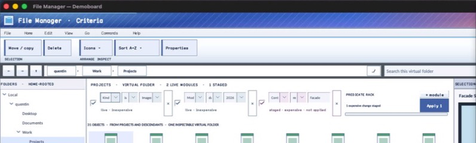

# InstrumentRack

- Status: **OBSERVED: bundle 006 split with source-private module control; M4 build, focused tests, and Screen Sharing pass**
- Kind: **class / visual retained control**
- Hierarchy: `Panel → InstrumentRack`
- Declaration: `include/gui_forms/controls/panel/instrument_rack/instrument_rack.hpp:14`
- Definition: `src/controls/panel/instrument_rack/instrument_rack.cpp`

InstrumentRack is a bounded retained editor rack that reconciles stable module/field identities across model replacements, owns real choice/text/check/button/status controls, preserves surviving focus and popup state, responsively wraps or compacts modules, scrolls one plane, emits typed commit/toggle/remove/reorder events, and hosts an optional caller-owned action subtree.

## Visual evidence



## Declared methods

### `InstrumentRack` (public)

```cpp
explicit InstrumentRack(StableId stable_id)
```

Constructs the rack coordinator, source-private module shells, and default layout policy.

### `~InstrumentRack` (public)

```cpp
~InstrumentRack() override
```

Releases reconciled module state and owned subscriptions after normal Control disposal.

### `modules` (public)

```cpp
[[nodiscard]] const std::vector<InstrumentModuleSpec>& modules() const noexcept
```

Returns the normalized caller-facing module model in current order.

### `set_modules` (public)

```cpp
void set_modules(std::vector<InstrumentModuleSpec> modules)
```

Validates bounded UTF-8 identities/fields, reconciles surviving controls by stable ID, disposes removed shells, preserves useful focus, and refreshes layout.

### `field_editor` (public)

```cpp
[[nodiscard]] Control::Ptr field_editor(std::string_view module_id, std::string_view field_id) const
```

Returns the real retained editor for a stable module/field pair.

### `module_bounds` (public)

```cpp
[[nodiscard]] std::optional<Rect> module_bounds( std::string_view module_id) const noexcept
```

Returns the last logical rack bounds for a stable module.

### `set_module_enabled` (public)

```cpp
bool set_module_enabled(std::string_view module_id, bool enabled)
```

Commits module enabled state and synchronizes descendants and public model.

### `set_module_state` (public)

```cpp
bool set_module_state(std::string_view module_id, InstrumentModuleState state, std::string status_text)
```

Commits live/staged/pending/invalid state and status text, then refreshes presentation.

### `set_field_value` (public)

```cpp
bool set_field_value(std::string_view module_id, std::string_view field_id, std::string value)
```

Synchronizes one real editor and public model without emitting a user commit.

### `set_field_validation` (public)

```cpp
bool set_field_validation(std::string_view module_id, std::string_view field_id, std::string message)
```

Commits validation text and refreshes module/accessibility presentation.

### `set_action_content` (public)

```cpp
void set_action_content(Control::Ptr content, double minimum_width = 170.0)
```

Validates and assumes ownership of an unparented action subtree plus its minimum slot width.

### `action_content` (public)

```cpp
[[nodiscard]] Control::Ptr action_content() const noexcept
```

Returns the optional caller-owned retained action subtree.

### `module_width` (public)

```cpp
[[nodiscard]] double module_width() const noexcept
```

Returns preferred logical module slot width.

### `set_module_width` (public)

```cpp
void set_module_width(double width)
```

Validates positive width and invalidates responsive layout.

### `module_height` (public)

```cpp
[[nodiscard]] double module_height() const noexcept
```

Returns preferred noncompact module height.

### `set_module_height` (public)

```cpp
void set_module_height(double height)
```

Validates positive height and invalidates responsive layout.

### `rack_gap` (public)

```cpp
[[nodiscard]] double rack_gap() const noexcept
```

Returns logical inter-slot and inter-line spacing.

### `set_rack_gap` (public)

```cpp
void set_rack_gap(double gap)
```

Validates finite nonnegative spacing and refreshes layout.

### `content_height` (public)

```cpp
[[nodiscard]] double content_height() const noexcept
```

Returns the last computed wrapped content height.

### `preferred_height` (public)

```cpp
[[nodiscard]] double preferred_height(double available_width) const
```

Computes bounded wrapped height for a positive available width without arranging.

### `scroll_offset` (public)

```cpp
[[nodiscard]] double scroll_offset() const noexcept
```

Returns the single retained vertical scroll origin.

### `set_scroll_offset` (public)

```cpp
void set_scroll_offset(double offset)
```

Clamps offset to content/viewport bounds, re-arranges children, and refreshes paint/hit testing/semantics.

### `field_changed` (public)

```cpp
[[nodiscard]] Event<const InstrumentFieldChange&>& field_changed() noexcept
```

Returns the event for live text/choice transitions.

### `field_committed` (public)

```cpp
[[nodiscard]] Event<const InstrumentFieldChange&>& field_committed() noexcept
```

Returns the event for qualified field commits.

### `module_toggled` (public)

```cpp
[[nodiscard]] Event<const InstrumentModuleToggle&>& module_toggled() noexcept
```

Returns the event for committed enable-state changes.

### `remove_requested` (public)

```cpp
[[nodiscard]] Event<const InstrumentModuleRequest&>& remove_requested() noexcept
```

Returns the event requesting consumer-authorized module removal.

### `move_requested` (public)

```cpp
[[nodiscard]] Event<const InstrumentModuleMoveRequest&>& move_requested() noexcept
```

Returns the event requesting a stable module reorder.

### `measure` (public)

```cpp
[[nodiscard]] Size measure(Size available) override
```

Computes desired height from the responsive slot algorithm and available viewport.

### `arrange` (public)

```cpp
void arrange(Rect final_bounds) override
```

Commits bounds and arranges reconciled module/action slots against current scroll origin.

### `on_pointer` (public)

```cpp
void on_pointer(PointerEvent& event) override
```

Consumes wheel input to scroll the rack through its clamped state machine.

### `on_pointer_bubble` (public)

```cpp
void on_pointer_bubble(PointerEvent& event) override
```

Accepts unhandled descendant wheel input into the same rack scroll path.

### `on_key_preview` (public)

```cpp
void on_key_preview(KeyEvent& event) override
```

Maps Alt+Left/Right from a focused module descendant to typed reorder requests.

### `semantic_descriptor` (public)

```cpp
[[nodiscard]] SemanticDescriptor semantic_descriptor() const override
```

Projects a named group, module count, and included real descendants.

### `on_dispose` (protected)

```cpp
void on_dispose() noexcept override
```

Public InstrumentRack operation. Its exact signature is inventoried here; follow the linked implementation for callback order and failure behavior.
