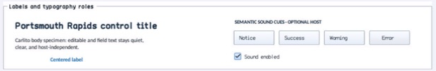

# Label

Status: **OBSERVED: bundle 002 split; M4 build, focused tests, and Screen Sharing pass**  
Kind: **class / visual retained control**  
Hierarchy: `Control → Label`  
Declaration: `include/gui_forms/controls/label/label.hpp:40`  
Definition: `src/controls/label/label.cpp`

Label is a noninteractive retained text primitive with inherited typography roles, explicit font/color overrides, horizontal and vertical alignment, word wrapping, bounded line count, line spacing, mnemonics, and static-text semantics.

## Visual evidence



## Public methods

### `Label`

```cpp
explicit Label(StableId stable_id, std::string text =
```

Constructs retained text and reflected Text, Font, ForeColor, and MaximumLines properties.

### `text`

```cpp
[[nodiscard]] const std::string& text() const noexcept
```

Returns the authored UTF-8 text including any mnemonic marker.

### `set_text`

```cpp
virtual void set_text(std::string text)
```

Commits text, publishes text_changed, and avoids ancestor layout work for fixed-size telemetry labels.

### `font`

```cpp
[[nodiscard]] FontSpec font() const noexcept
```

Resolves an explicit font or the active Theme typography token selected by text_style_role.

### `has_font_override`

```cpp
[[nodiscard]] bool has_font_override() const noexcept
```

Reports whether a caller-owned FontSpec supersedes Theme typography.

### `set_font`

```cpp
void set_font(FontSpec font)
```

Validates and installs an explicit FontSpec with measure, paint, and semantic invalidation.

### `clear_font`

```cpp
void clear_font()
```

Removes the explicit font and resumes inherited role typography.

### `text_style_role`

```cpp
[[nodiscard]] TextStyleRole text_style_role() const noexcept
```

Returns the body, control, caption, heading, title, or monospace typography role.

### `set_text_style_role`

```cpp
void set_text_style_role(TextStyleRole role)
```

Validates the role and updates inherited typography without disturbing an explicit font.

### `foreground`

```cpp
[[nodiscard]] Color foreground() const noexcept
```

Resolves an explicit color or the active panel-role text color.

### `has_foreground_override`

```cpp
[[nodiscard]] bool has_foreground_override() const noexcept
```

Reports whether a caller-owned text color is active.

### `set_foreground`

```cpp
void set_foreground(Color color)
```

Installs an explicit foreground color and invalidates paint and semantics.

### `clear_foreground`

```cpp
void clear_foreground()
```

Removes the explicit color and resumes Theme text color.

### `alignment`

```cpp
[[nodiscard]] HorizontalAlignment alignment() const noexcept
```

Returns per-line near, center, or far horizontal alignment.

### `set_alignment`

```cpp
void set_alignment(HorizontalAlignment alignment)
```

Validates and commits horizontal alignment without changing measurement.

### `vertical_alignment`

```cpp
[[nodiscard]] VerticalAlignment vertical_alignment() const noexcept
```

Returns near, center, or far placement for the complete line block.

### `set_vertical_alignment`

```cpp
void set_vertical_alignment(VerticalAlignment alignment)
```

Validates and commits vertical block alignment.

### `text_wrapping`

```cpp
[[nodiscard]] TextWrapping text_wrapping() const noexcept
```

Returns no-wrap or renderer-neutral word wrapping policy.

### `set_text_wrapping`

```cpp
void set_text_wrapping(TextWrapping wrapping)
```

Validates wrapping policy and invalidates size, paint, and semantics.

### `line_spacing`

```cpp
[[nodiscard]] double line_spacing() const noexcept
```

Returns the font-size multiplier used between retained baselines.

### `set_line_spacing`

```cpp
void set_line_spacing(double spacing)
```

Accepts only finite values from 0.75 through 3.0 and invalidates affected phases.

### `maximum_lines`

```cpp
[[nodiscard]] std::size_t maximum_lines() const noexcept
```

Returns zero for unlimited lines or the positive measure/paint line ceiling.

### `set_maximum_lines`

```cpp
void set_maximum_lines(std::size_t maximum_lines)
```

Accepts zero through 4096, bounds desired height and actual painting, and leaves full semantic text intact.

### `use_mnemonic`

```cpp
[[nodiscard]] bool use_mnemonic() const noexcept
```

Reports whether ampersands define a displayed mnemonic.

### `set_use_mnemonic`

```cpp
void set_use_mnemonic(bool value)
```

Toggles mnemonic display parsing and focus-next routing.

### `text_changed`

```cpp
[[nodiscard]] Event<const std::string&>& text_changed() noexcept
```

Returns the event published after retained text commits.

### `measure`

```cpp
[[nodiscard]] Size measure(Size available) override
```

Wraps text against the active constraint, applies MaximumLines, and derives content size unless fixed bounds win.

### `on_paint`

```cpp
void on_paint(Painter& painter, Rect local_damage) override
```

Records aligned visible lines with the resolved font, foreground, spacing, and line ceiling.

### `hit_test_local`

```cpp
[[nodiscard]] bool hit_test_local(Point local_point) const override
```

Always declines hits so text labels remain transparent to container interaction.

### `semantic_descriptor`

```cpp
[[nodiscard]] SemanticDescriptor semantic_descriptor() const override
```

Projects full displayed text as an exposed static-text node independently of visual line limiting.
