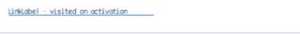

# LinkLabel

- Status: **OBSERVED: bundle 002 split; M4 build, focused tests, and Screen Sharing pass**
- Kind: **class / visual retained control**
- Hierarchy: `ButtonBase → LinkLabel`
- Declaration: `include/gui_forms/controls/button_base/link_label/link_label.hpp:7`
- Definition: `src/controls/button_base/link_label/link_label.cpp`

LinkLabel is a ButtonBase command presented as underlined link text, with retained visited state committed before click publication and link semantics.

## Visual evidence



## Declared methods

### `LinkLabel` (public)

```cpp
explicit LinkLabel(StableId stable_id, std::string text =
```

Constructs an ordinary ButtonBase command using link presentation.

### `visited` (public)

```cpp
[[nodiscard]] bool visited() const noexcept
```

Reports whether the link has completed activation.

### `set_visited` (public)

```cpp
void set_visited(bool visited)
```

Commits visited state and invalidates paint and semantics.

### `on_paint` (public)

```cpp
void on_paint(Painter& painter, Rect local_damage) override
```

Records resolved link text color, underline geometry, and focus cue without a button frame.

### `on_activate` (public)

```cpp
void on_activate() override
```

Marks the link visited before publishing the inherited click event.

### `semantic_descriptor` (public)

```cpp
[[nodiscard]] SemanticDescriptor semantic_descriptor() const override
```

Projects link role, visited state, displayed name, and press action.
