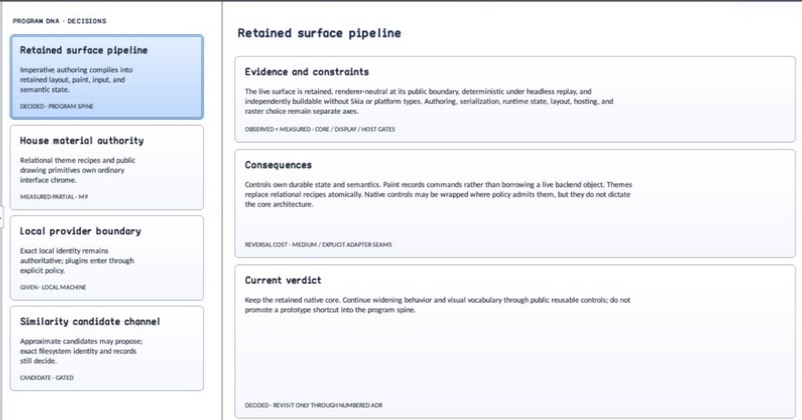

# MasterDetailView

Status: **OBSERVED: bundle 001 split; M4 build and focused tests pass**  
Kind: **class / visual retained control**  
Hierarchy: `ContainerControl → MasterDetailView`  
Declaration: `include/gui_forms/controls/container/master_detail_view/master_detail_view.hpp:42`  
Definition: `src/controls/container/master_detail_view/master_detail_view.cpp`

MasterDetailView is a content-agnostic retained shell over SplitContainer with explicit role ownership, theme-derived or explicit splitter policy, responsive compact presentation, focus-safe collapse, and inspectable presentation events.

## Visual evidence



## Public methods

### `MasterDetailView`

```cpp
explicit MasterDetailView(StableId stable_id)
```

Constructs private SplitContainer infrastructure and configures it from the active structural layout policy; visual attachment remains lazy.

### `initialize_control_tree`

```cpp
void initialize_control_tree()
```

Attaches the owned SplitContainer exactly once.

### `master`

```cpp
[[nodiscard]] Control::Ptr master() const noexcept
```

Returns the control occupying the master role.

### `detail`

```cpp
[[nodiscard]] Control::Ptr detail() const noexcept
```

Returns the control occupying the detail role.

### `set_master`

```cpp
[[nodiscard]] Control::Ptr set_master(Control::Ptr control)
```

Docks an unparented control into the first splitter panel and returns the detached predecessor; infrastructure and cross-role reuse are rejected.

### `set_detail`

```cpp
[[nodiscard]] Control::Ptr set_detail(Control::Ptr control)
```

Docks an unparented control into the second splitter panel and returns the detached predecessor; infrastructure and cross-role reuse are rejected.

### `split_container`

```cpp
[[nodiscard]] std::shared_ptr<SplitContainer> split_container() const noexcept
```

Returns the genuine retained SplitContainer used for rendering, accessibility, pointer dragging, and keyboard splitter behavior.

### `master_detail_layout`

```cpp
[[nodiscard]] const MasterDetailLayout& master_detail_layout() const noexcept
```

Returns the stored explicit layout value; use effective_master_detail_layout for the active policy.

### `uses_theme_layout`

```cpp
[[nodiscard]] bool uses_theme_layout() const noexcept
```

Reports whether current splitter dimensions and breakpoint derive from structural Theme tokens.

### `effective_master_detail_layout`

```cpp
[[nodiscard]] MasterDetailLayout effective_master_detail_layout() const noexcept
```

Resolves inherited structural Theme geometry or the explicit bounded layout.

### `set_master_detail_layout`

```cpp
void set_master_detail_layout(MasterDetailLayout layout)
```

Validates finite ordered extents, makes the explicit layout authoritative, reconfigures the splitter, and invalidates all affected retained phases.

### `reset_master_detail_layout_to_theme`

```cpp
void reset_master_detail_layout_to_theme()
```

Restores inherited structural Theme geometry and reconfigures the genuine splitter.

### `display_mode`

```cpp
[[nodiscard]] MasterDetailDisplayMode display_mode() const noexcept
```

Returns the requested automatic or explicit presentation mode.

### `set_display_mode`

```cpp
void set_display_mode(MasterDetailDisplayMode mode)
```

Selects automatic, side-by-side, master-only, or detail-only presentation; invalid values fail atomically.

### `effective_display_mode`

```cpp
[[nodiscard]] MasterDetailDisplayMode effective_display_mode() const noexcept
```

Returns the presentation currently applied after responsive resolution.

### `compact_detail_visible`

```cpp
[[nodiscard]] bool compact_detail_visible() const noexcept
```

Reports which role automatic compact presentation should expose.

### `set_compact_detail_visible`

```cpp
void set_compact_detail_visible(bool visible)
```

Selects master or detail for the next automatic compact arrangement.

### `show_master`

```cpp
void show_master()
```

Convenience operation selecting the master role in compact automatic mode.

### `show_detail`

```cpp
void show_detail()
```

Convenience operation selecting the detail role in compact automatic mode.

### `presentation_changed`

```cpp
[[nodiscard]] Event<const MasterDetailPresentationChange&>& presentation_changed() noexcept
```

Returns events describing previous/current applied mode and whether accommodation caused the transition.

### `measure`

```cpp
[[nodiscard]] Size measure(Size available) override
```

Measures stable snapshots of both role controls, tolerates mutation during callbacks, and combines desired size according to resolved orientation/mode.

### `arrange`

```cpp
void arrange(Rect final_bounds) override
```

Configures and attaches the splitter, resolves responsive mode from final bounds, applies collapse with an explicit origin, and fills the view.

### `semantic_descriptor`

```cpp
[[nodiscard]] SemanticDescriptor semantic_descriptor() const override
```

Projects an optional named group whose value reports side-by-side, master, or detail presentation.
