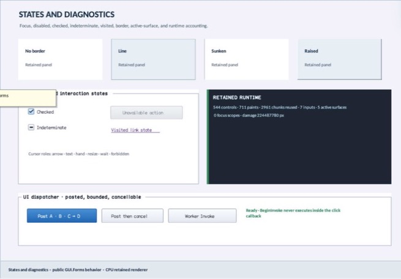

# MetricsView

- Status: **OBSERVED: bundle 006 split and accent-width enhancement; M4 build, focused tests, and Screen Sharing pass**
- Kind: **class / visual retained control**
- Hierarchy: `Control → MetricsView`
- Declaration: `include/gui_forms/controls/metrics_view/metrics_view.hpp:10`
- Definition: `src/controls/metrics_view/metrics_view.cpp`

MetricsView is an input-transparent diagnostic control over Window's structured metrics snapshot. It formats bounded live counters into a retained card with caller-owned title/style/accent width and group semantics; it does not replace the snapshot as instrumentation authority.

## Visual evidence



## Declared methods

### `MetricsView` (public)

```cpp
explicit MetricsView(StableId stable_id, std::string title = "Runtime metrics")
```

Constructs a titled noninteractive diagnostic projection.

### `title` (public)

```cpp
[[nodiscard]] const std::string& title() const noexcept
```

Returns the retained diagnostic heading.

### `set_title` (public)

```cpp
void set_title(std::string title)
```

Commits title, synchronizes accessible name, and invalidates paint and semantics.

### `style` (public)

```cpp
[[nodiscard]] const BasicControlStyle& style() const noexcept
```

Returns the compatibility color/style palette used by the card.

### `set_style` (public)

```cpp
void set_style(BasicControlStyle style)
```

Commits palette and invalidates paint.

### `accent_width` (public)

```cpp
[[nodiscard]] double accent_width() const noexcept
```

Returns the logical width of the leading diagnostic rail.

### `set_accent_width` (public)

```cpp
void set_accent_width(double width)
```

Validates a width within [1, 32] and refreshes paint.

### `on_paint` (public)

```cpp
void on_paint(Painter& painter, Rect local_damage) override
```

Records backplane, accent rail, title, and a bounded two-line Window metrics readout.

### `hit_test_local` (public)

```cpp
[[nodiscard]] bool hit_test_local(Point local_point) const override
```

Always rejects input because metrics are observational.

### `semantic_descriptor` (public)

```cpp
[[nodiscard]] SemanticDescriptor semantic_descriptor() const override
```

Projects group role, title, and the current structured metrics readout.

### `metrics_text` (private)

```cpp
[[nodiscard]] std::string metrics_text() const
```

Reports the current metrics text value without mutation.
