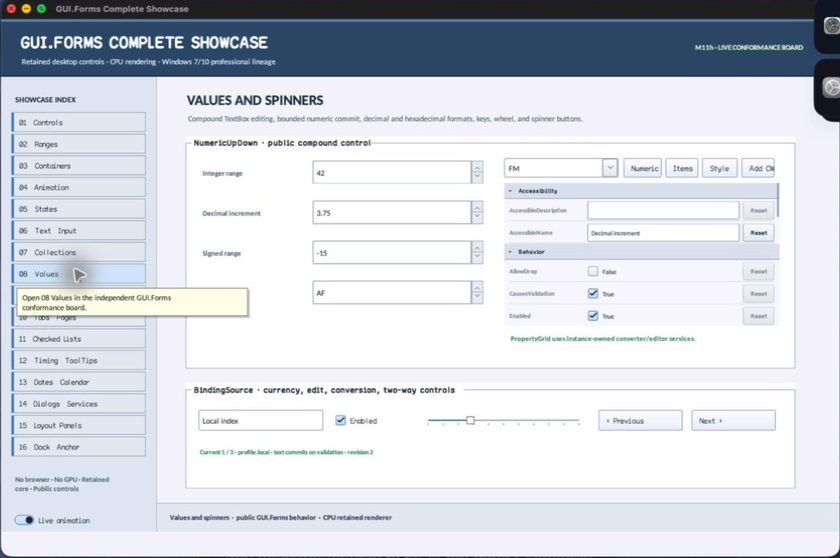

# NumericUpDown

- Status: **OBSERVED: bundle 004 split and button-width enhancement; M4 build, focused tests, and Screen Sharing pass**
- Kind: **class / visual retained control**
- Hierarchy: `Panel → NumericUpDown`
- Declaration: `include/gui_forms/controls/panel/numeric_up_down/numeric_up_down.hpp:12`
- Definition: `src/controls/panel/numeric_up_down/numeric_up_down.cpp`

NumericUpDown is a retained composite numeric editor over an owned TextBox and source-private SpinButtons. It enforces ordered ranges, bounded step/precision/button geometry, decimal or hexadecimal formatting, commit synchronization, semantic range actions, and one authoritative value event.

## Visual evidence



## Declared methods

### `NumericUpDown` (public)

```cpp
explicit NumericUpDown(StableId stable_id)
```

Constructs owned editor and spin controls while deferring child attachment until shared ownership exists.

### `initialize_control_tree` (public)

```cpp
void initialize_control_tree()
```

Attaches owned children and subscriptions exactly once, then synchronizes presentation.

### `minimum` (public)

```cpp
[[nodiscard]] double minimum() const noexcept
```

Returns the inclusive lower value bound.

### `maximum` (public)

```cpp
[[nodiscard]] double maximum() const noexcept
```

Returns the inclusive upper value bound.

### `set_range` (public)

```cpp
void set_range(double minimum, double maximum)
```

Validates finite ordered bounds, constrains the current value, and refreshes editor and semantics atomically.

### `value` (public)

```cpp
[[nodiscard]] double value() const noexcept
```

Returns the authoritative constrained numeric value.

### `set_value` (public)

```cpp
void set_value(double value)
```

Validates finiteness, clamps to the range, synchronizes text, and publishes a real value change.

### `increment` (public)

```cpp
[[nodiscard]] double increment() const noexcept
```

Returns the positive step magnitude.

### `set_increment` (public)

```cpp
void set_increment(double increment)
```

Accepts a finite positive increment and refreshes semantic range metadata.

### `decimal_places` (public)

```cpp
[[nodiscard]] std::uint8_t decimal_places() const noexcept
```

Returns the bounded fixed-point precision used outside hexadecimal mode.

### `set_decimal_places` (public)

```cpp
void set_decimal_places(std::uint8_t places)
```

Accepts supported precision and reformats the owned editor.

### `hexadecimal` (public)

```cpp
[[nodiscard]] bool hexadecimal() const noexcept
```

Reports whether integral hexadecimal presentation and parsing are active.

### `set_hexadecimal` (public)

```cpp
void set_hexadecimal(bool hexadecimal)
```

Toggles hexadecimal policy and synchronizes editor projection.

### `button_width` (public)

```cpp
[[nodiscard]] double button_width() const noexcept
```

Returns the logical allocation reserved for the spin-button column.

### `set_button_width` (public)

```cpp
void set_button_width(double width)
```

Accepts a finite 12–64 logical-pixel width and invalidates composite layout.

### `editor` (public)

```cpp
[[nodiscard]] std::shared_ptr<TextBox> editor() const noexcept
```

Returns the owned TextBox for composition-aware inspection and focus routing.

### `value_changed` (public)

```cpp
[[nodiscard]] Event<double>& value_changed() noexcept
```

Returns the event published after authoritative value commits.

### `arrange` (public)

```cpp
void arrange(Rect final_bounds) override
```

Allocates the editor and trailing button column from current button-width policy.

### `on_key_preview` (public)

```cpp
void on_key_preview(KeyEvent& event) override
```

Handles Up/Down stepping before the focused TextBox consumes the key.

### `on_pointer_preview` (public)

```cpp
void on_pointer_preview(PointerEvent& event) override
```

Initializes the owned control tree before routed pointer interaction.

### `semantic_descriptor` (public)

```cpp
[[nodiscard]] SemanticDescriptor semantic_descriptor() const override
```

Projects a spin-button role with numeric range, current value, step actions, and formatted text.

### `on_semantic_action` (public)

```cpp
bool on_semantic_action(SemanticAction action, std::string_view value) override
```

Routes increment, decrement, and set-value through common validation and commit logic.

### `step` (private)

```cpp
void step(int direction)
```

Public NumericUpDown operation. Its exact signature is inventoried here; follow the linked implementation for callback order and failure behavior.

### `commit_editor_text` (private)

```cpp
void commit_editor_text()
```

Public NumericUpDown operation. Its exact signature is inventoried here; follow the linked implementation for callback order and failure behavior.

### `synchronize_editor` (private)

```cpp
void synchronize_editor()
```

Public NumericUpDown operation. Its exact signature is inventoried here; follow the linked implementation for callback order and failure behavior.

### `formatted_value` (private)

```cpp
[[nodiscard]] std::string formatted_value() const
```

Reports the current formatted value value without mutation.
