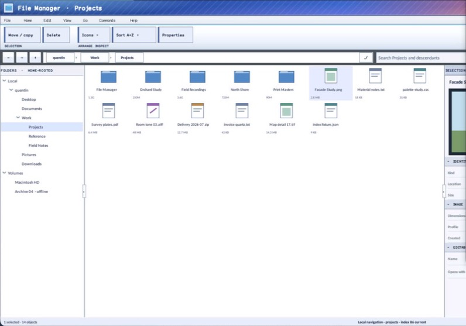

# ObjectView

- Status: **OBSERVED: bundle 005 split and secondary-text enhancement; M4 build, focused tests, and Screen Sharing pass**
- Kind: **class / visual retained control**
- Hierarchy: `Panel → ObjectView`
- Declaration: `include/gui_forms/controls/panel/object_view/object_view.hpp:61`
- Definition: `src/controls/panel/object_view/object_view.cpp`

ObjectView is a virtualized retained collection surface with icon-grid and details projections over one stable item model. It owns single or multiple selection, focus and range anchors, keyboard/pointer/context behavior, configurable cell geometry, optional secondary text, and virtual item semantics.

## Visual evidence



## Declared methods

### `ObjectView` (public)

```cpp
explicit ObjectView(StableId stable_id)
```

Constructs a focusable collection surface with stable multi-selection, item activation, and context routing.

### `items` (public)

```cpp
[[nodiscard]] std::span<const ObjectViewItem> items() const noexcept
```

Returns the authored object records in presentation order.

### `set_items` (public)

```cpp
void set_items(std::vector<ObjectViewItem> items)
```

Validates identities, replaces the item model, and reconciles selection, focus, anchor, and scroll state.

### `view_mode` (public)

```cpp
[[nodiscard]] ObjectViewMode view_mode() const noexcept
```

Returns icon-grid or details-row presentation.

### `set_view_mode` (public)

```cpp
void set_view_mode(ObjectViewMode mode)
```

Validates and commits presentation mode while preserving stable selection and focus.

### `selected_id` (public)

```cpp
[[nodiscard]] std::string_view selected_id() const noexcept
```

Returns the primary selected identity, if any.

### `set_selected_id` (public)

```cpp
void set_selected_id(std::string_view stable_id)
```

Replaces selection with the admitted identity and publishes a real transition.

### `selected_ids` (public)

```cpp
[[nodiscard]] std::span<const std::string> selected_ids() const noexcept
```

Returns all selected stable identities in item order.

### `set_selected_ids` (public)

```cpp
void set_selected_ids(std::vector<std::string> stable_ids, std::string_view primary_id =
```

Validates, normalizes, and commits caller-supplied selection under the current policy.

### `clear_selection` (public)

```cpp
void clear_selection()
```

Clears authoritative selection while retaining a usable focus position.

### `select_all` (public)

```cpp
void select_all()
```

Selects every admitted item when multiple selection is enabled.

### `selection_mode` (public)

```cpp
[[nodiscard]] ObjectSelectionMode selection_mode() const noexcept
```

Returns the current single, multi-simple, or multi-extended policy.

### `set_selection_mode` (public)

```cpp
void set_selection_mode(ObjectSelectionMode mode)
```

Commits selection policy and normalizes any incompatible retained selection.

### `selection_anchor_id` (public)

```cpp
[[nodiscard]] std::string_view selection_anchor_id() const noexcept
```

Returns the stable anchor used for range extension.

### `focused_id` (public)

```cpp
[[nodiscard]] std::string_view focused_id() const noexcept
```

Returns the keyboard-focused item identity independently of selection.

### `icon_cell_size` (public)

```cpp
[[nodiscard]] Size icon_cell_size() const noexcept
```

Returns logical icon-grid cell geometry.

### `set_icon_cell_size` (public)

```cpp
void set_icon_cell_size(Size size)
```

Validates bounded cell dimensions and refreshes layout, paint, and hit testing.

### `details_row_height` (public)

```cpp
[[nodiscard]] double details_row_height() const noexcept
```

Returns logical height for details-mode rows.

### `set_details_row_height` (public)

```cpp
void set_details_row_height(double height)
```

Validates bounded row height and refreshes details geometry.

### `show_secondary_text` (public)

```cpp
[[nodiscard]] bool show_secondary_text() const noexcept
```

Reports whether optional subtitle and metadata fields are painted.

### `set_show_secondary_text` (public)

```cpp
void set_show_secondary_text(bool show)
```

Toggles secondary presentation while preserving the authoritative item model.

### `top_row` (public)

```cpp
[[nodiscard]] std::size_t top_row() const noexcept
```

Returns the first row projected into the viewport.

### `set_top_row` (public)

```cpp
void set_top_row(std::size_t row)
```

Clamps and commits the scroll-row origin for the active presentation.

### `font` (public)

```cpp
[[nodiscard]] FontSpec font() const noexcept
```

Returns the retained item typography.

### `set_font` (public)

```cpp
void set_font(FontSpec font)
```

Validates typography and invalidates collection measurement and paint.

### `image_list` (public)

```cpp
[[nodiscard]] std::shared_ptr<ImageList> image_list() const noexcept
```

Returns the optional shared source used to resolve item image keys.

### `set_image_list` (public)

```cpp
void set_image_list(std::shared_ptr<ImageList> image_list)
```

Rebinds imagery without changing object identities or selection.

### `selection_changed` (public)

```cpp
[[nodiscard]] Event<const ObjectSelectionChange&>& selection_changed() noexcept
```

Returns the event published with normalized selected identities after a real commit.

### `item_activated` (public)

```cpp
[[nodiscard]] Event<const std::string&>& item_activated() noexcept
```

Returns the event carrying the stable item activated by pointer, keyboard, or semantics.

### `context_requested` (public)

```cpp
[[nodiscard]] Event<const ObjectContextRequest&>& context_requested() noexcept
```

Returns the event carrying item identity and logical position for context UI.

### `arrange` (public)

```cpp
void arrange(Rect final_bounds) override
```

Commits viewport geometry, clamps scrolling, and ensures focused content remains reachable.

### `on_paint` (public)

```cpp
void on_paint(Painter& painter, Rect local_damage) override
```

Records only visible icon cells or detail rows with imagery, text, selection, hover, and focus.

### `on_pointer` (public)

```cpp
void on_pointer(PointerEvent& event) override
```

Handles item hit testing, modifier-aware selection, context requests, capture qualification, and activation.

### `on_key` (public)

```cpp
void on_key(KeyEvent& event) override
```

Implements spatial/list navigation, range extension, select-all, activation, context request, and paging.

### `on_text_input` (public)

```cpp
void on_text_input(TextInputEvent& event) override
```

Performs time-bounded prefix focus and selection over authored item text.

### `on_focus_changed` (public)

```cpp
void on_focus_changed(bool focused) override
```

Commits focus presentation and restores a usable focused item when entering the control.

### `semantic_descriptor` (public)

```cpp
[[nodiscard]] SemanticDescriptor semantic_descriptor() const override
```

Projects list or grid semantics with selection policy and item count.

### `semantic_virtual_children` (public)

```cpp
[[nodiscard]] std::vector<SemanticNode> semantic_virtual_children() const override
```

Exposes realized item identities with names, descriptions, selection, focus, and actions.

### `on_semantic_child_action` (public)

```cpp
bool on_semantic_child_action(std::string_view stable_id, SemanticAction action, std::string_view value) override
```

Routes virtual selection and press through ordinary selection and activation state machines.

### `on_attached_to_window` (protected)

```cpp
void on_attached_to_window() override
```

Executes ObjectView's on attached to window operation against retained state; the signature records its exact inputs, result, constness, and failure surface.

### `item_index` (private)

```cpp
[[nodiscard]] std::optional<std::size_t> item_index( std::string_view stable_id) const noexcept
```

Reports the current item index value without mutation.

### `columns` (private)

```cpp
[[nodiscard]] std::size_t columns() const noexcept
```

Reports the current columns value without mutation.

### `row_height` (private)

```cpp
[[nodiscard]] double row_height() const noexcept
```

Reports the current row height value without mutation.

### `visible_row_count` (private)

```cpp
[[nodiscard]] std::size_t visible_row_count() const noexcept
```

Reports the current visible row count value without mutation.

### `item_bounds` (private)

```cpp
[[nodiscard]] Rect item_bounds(std::size_t index) const noexcept
```

Reports the current item bounds value without mutation.

### `index_at` (private)

```cpp
[[nodiscard]] std::optional<std::size_t> index_at(Point absolute) const noexcept
```

Reports the current index at value without mutation.

### `ensure_visible` (private)

```cpp
void ensure_visible(std::size_t index)
```

Executes ObjectView's ensure visible operation against retained state; the signature records its exact inputs, result, constness, and failure surface.

### `select_index` (private)

```cpp
void select_index(std::size_t index, bool activate, Modifier modifiers = Modifier::none)
```

Executes ObjectView's select index operation against retained state; the signature records its exact inputs, result, constness, and failure surface.

### `focus_index` (private)

```cpp
void focus_index(std::size_t index)
```

Executes ObjectView's focus index operation against retained state; the signature records its exact inputs, result, constness, and failure surface.

### `apply_selection` (private)

```cpp
void apply_selection(std::vector<std::string> stable_ids, std::string primary_id, std::string anchor_id, bool move_focus)
```

Executes ObjectView's apply selection operation against retained state; the signature records its exact inputs, result, constness, and failure surface.

### `is_selected` (private)

```cpp
[[nodiscard]] bool is_selected(std::string_view stable_id) const noexcept
```

Reports the current is selected value without mutation.

### `range_selection` (private)

```cpp
[[nodiscard]] std::vector<std::string> range_selection( std::size_t target_index, bool preserve_existing) const
```

Reports the current range selection value without mutation.

### `type_select` (private)

```cpp
void type_select(std::string_view text)
```

Executes ObjectView's type select operation against retained state; the signature records its exact inputs, result, constness, and failure surface.

### `paint_glyph` (private)

```cpp
void paint_glyph(Painter& painter, Rect bounds, ObjectGlyph glyph, bool enabled) const
```

Reports the current paint glyph value without mutation.
