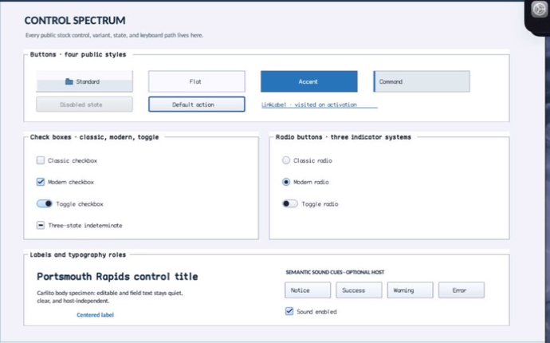

# Panel

- Status: **OBSERVED: bundle 002 split; M4 build, focused tests, and Screen Sharing pass**
- Kind: **class / visual retained control**
- Hierarchy: `ScrollableControl → Panel`
- Declaration: `include/gui_forms/controls/panel/panel.hpp:18`
- Definition: `src/controls/panel/panel.cpp`

Panel is the reusable retained scroll-capable surface primitive with theme-role rendering, explicit background/style overrides, bounded border vocabulary, visual outsets, and optional named-group semantics.

## Visual evidence



## Declared methods

### `Panel` (public)

```cpp
explicit Panel(StableId stable_id)
```

Constructs a backplane ScrollableControl whose ordinary appearance resolves through the panel theme role.

### `border_style` (public)

```cpp
[[nodiscard]] BorderStyle border_style() const noexcept
```

Returns the retained none, line, sunken, or raised border policy.

### `set_border_style` (public)

```cpp
void set_border_style(BorderStyle style)
```

Validates the closed border vocabulary, commits a real change, and invalidates paint and semantics atomically.

### `background` (public)

```cpp
[[nodiscard]] Color background() const noexcept
```

Resolves the explicit background override or the leading color of the active theme material.

### `has_background_override` (public)

```cpp
[[nodiscard]] bool has_background_override() const noexcept
```

Reports whether a caller-owned background currently supersedes theme material fill.

### `set_background` (public)

```cpp
void set_background(Color color)
```

Installs a caller-owned solid background and invalidates painting.

### `clear_background` (public)

```cpp
void clear_background()
```

Removes the solid override and restores active theme material resolution.

### `style` (public)

```cpp
[[nodiscard]] const BasicControlStyle& style() const noexcept
```

Returns the explicit legacy BasicControlStyle or the current theme fallback.

### `has_style_override` (public)

```cpp
[[nodiscard]] bool has_style_override() const noexcept
```

Reports whether legacy style colors override the role recipe.

### `set_style` (public)

```cpp
void set_style(BasicControlStyle style)
```

Installs an explicit BasicControlStyle for compatibility painting and semantic appearance.

### `clear_style` (public)

```cpp
void clear_style()
```

Removes the explicit compatibility style and resumes theme recipes.

### `visual_role` (public)

```cpp
[[nodiscard]] ControlVisualRole visual_role() const noexcept
```

Returns the theme role used when no explicit style/background is authoritative.

### `set_visual_role` (public)

```cpp
void set_visual_role(ControlVisualRole role)
```

Accepts only panel-compatible roles, then invalidates style, paint, and semantics.

### `on_paint` (public)

```cpp
void on_paint(Painter& painter, Rect local_damage) override
```

Records the resolved material or compatibility panel frame into the renderer-neutral Painter.

### `visual_outsets` (public)

```cpp
[[nodiscard]] Insets visual_outsets() const noexcept override
```

Reports shadow/filter outsets from the active surface material, or none for legacy style painting.

### `semantic_descriptor` (public)

```cpp
[[nodiscard]] SemanticDescriptor semantic_descriptor() const override
```

Projects a named Panel as an exposed group and leaves an unnamed structural Panel unexposed.

### `local_bounds` (protected)

```cpp
[[nodiscard]] Rect local_bounds() const noexcept
```

Reports the current local bounds value without mutation.

### `paint_panel` (protected)

```cpp
void paint_panel(Painter& painter, Rect bounds) const
```

Reports the current paint panel value without mutation.
