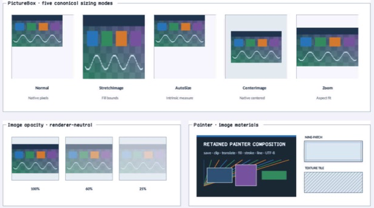

# PictureBox

- Status: **OBSERVED: bundle 002 split; M4 build, focused tests, and Screen Sharing pass**
- Kind: **class / visual retained control**
- Hierarchy: `Panel → PictureBox`
- Declaration: `include/gui_forms/controls/panel/picture_box/picture_box.hpp:21`
- Definition: `src/controls/panel/picture_box/picture_box.cpp`

PictureBox is a noninteractive Panel image presenter over Window-owned generational resources, with five canonical sizing modes, bounded opacity, inspectable image geometry, and image semantics.

## Visual evidence



## Declared methods

### `PictureBox` (public)

```cpp
explicit PictureBox(StableId stable_id)
```

Constructs a clipped image surface and registers its reflected SizeMode property schema.

### `image` (public)

```cpp
[[nodiscard]] ImageId image() const noexcept
```

Returns the retained generational ImageId, which may be empty or stale.

### `set_image` (public)

```cpp
void set_image(ImageId image)
```

Validates Window ownership when attached, selects the resource, and publishes image_changed after invalidation.

### `clear_image` (public)

```cpp
void clear_image()
```

Routes through set_image with an empty ImageId so clearing obeys the same event order.

### `has_valid_image` (public)

```cpp
[[nodiscard]] bool has_valid_image() const noexcept
```

Reports whether the current ImageId resolves in the attached Window registry.

### `image_size` (public)

```cpp
[[nodiscard]] Size image_size() const noexcept
```

Returns current resource pixel dimensions in logical Size form, or an empty size when unavailable.

### `size_mode` (public)

```cpp
[[nodiscard]] PictureBoxSizeMode size_mode() const noexcept
```

Returns normal, stretch, auto-size, centered, or aspect-preserving zoom policy.

### `set_size_mode` (public)

```cpp
void set_size_mode(PictureBoxSizeMode mode)
```

Validates the closed sizing vocabulary and updates measurement/paint/property state atomically.

### `image_opacity` (public)

```cpp
[[nodiscard]] double image_opacity() const noexcept
```

Returns the retained image alpha multiplier.

### `set_image_opacity` (public)

```cpp
void set_image_opacity(double opacity)
```

Accepts only finite values from zero through one and invalidates painting.

### `image_bounds` (public)

```cpp
[[nodiscard]] Rect image_bounds() const noexcept
```

Computes the local destination rectangle from content bounds, source dimensions, and size mode.

### `image_changed` (public)

```cpp
[[nodiscard]] Event<ImageId>& image_changed() noexcept
```

Returns the event published after a complete image selection change.

### `measure` (public)

```cpp
[[nodiscard]] Size measure(Size available) override
```

Uses source dimensions for auto-size and otherwise preserves ordinary Panel sizing constraints.

### `on_paint` (public)

```cpp
void on_paint(Painter& painter, Rect local_damage) override
```

Paints the Panel first, clips to content, and records the live image at resolved bounds and opacity.

### `hit_test_local` (public)

```cpp
[[nodiscard]] bool hit_test_local(Point local_point) const override
```

Keeps PictureBox noninteractive so it does not intercept its container.

### `semantic_descriptor` (public)

```cpp
[[nodiscard]] SemanticDescriptor semantic_descriptor() const override
```

Projects an image role, authored accessible text, and the current resource identity without exposing pixels.

### `content_bounds` (private)

```cpp
[[nodiscard]] Rect content_bounds() const noexcept
```

Reports the current content bounds value without mutation.
