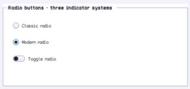

# RadioButton

- Status: **OBSERVED: bundle 002 split; M4 build, focused tests, and Screen Sharing pass**
- Kind: **class / visual retained control**
- Hierarchy: `ButtonBase → RadioButton`
- Declaration: `include/gui_forms/controls/button_base/radio_button/radio_button.hpp:9`
- Definition: `src/controls/button_base/radio_button/radio_button.cpp`

RadioButton specializes ButtonBase with retained checked state, container-scoped named exclusion groups, optional automatic checking, three indicator families, ordered events, and radio semantics.

## Visual evidence



## Declared methods

### `RadioButton` (public)

```cpp
explicit RadioButton(StableId stable_id, std::string text =
```

Constructs an unchecked auto-checking radio command with classic indicator policy.

### `checked` (public)

```cpp
[[nodiscard]] bool checked() const noexcept
```

Returns retained group selection state.

### `set_checked` (public)

```cpp
void set_checked(bool checked)
```

Commits selection and synchronously clears matching live peers within the exclusion scope.

### `group_name` (public)

```cpp
[[nodiscard]] const std::string& group_name() const noexcept
```

Returns the optional named exclusion key; an empty key uses the ordinary container scope.

### `set_group_name` (public)

```cpp
void set_group_name(std::string name)
```

Validates bounded UTF-8, updates group identity, and reconciles exclusion when already checked.

### `auto_check` (public)

```cpp
[[nodiscard]] bool auto_check() const noexcept
```

Reports whether activation selects the radio automatically.

### `set_auto_check` (public)

```cpp
void set_auto_check(bool enabled)
```

Enables or disables automatic selection during activation.

### `indicator_style` (public)

```cpp
[[nodiscard]] ChoiceIndicatorStyle indicator_style() const noexcept
```

Returns classic disc, modern disc, or toggle-switch presentation.

### `set_indicator_style` (public)

```cpp
void set_indicator_style(ChoiceIndicatorStyle style)
```

Validates indicator vocabulary and invalidates size, paint, and semantics.

### `checked_changed` (public)

```cpp
[[nodiscard]] Event<bool>& checked_changed() noexcept
```

Returns the event published after retained selection commits.

### `on_paint` (public)

```cpp
void on_paint(Painter& painter, Rect local_damage) override
```

Records the selected indicator family, text, focus, hover, press, and disabled cues.

### `visual_outsets` (public)

```cpp
[[nodiscard]] Insets visual_outsets() const noexcept override
```

Reports material outsets for the active visual recipe where applicable.

### `on_activate` (public)

```cpp
void on_activate() override
```

Selects through the group law when auto-checking, then publishes inherited click if still alive.

### `semantic_descriptor` (public)

```cpp
[[nodiscard]] SemanticDescriptor semantic_descriptor() const override
```

Projects radio-button role, checked state, group-aware selection, and press action.

### `set_checked_without_exclusion` (private)

```cpp
void set_checked_without_exclusion(bool checked)
```

Synchronously updates the retained checked without exclusion property. Validation, typed invalidation, and notifications are defined by the implementation.
