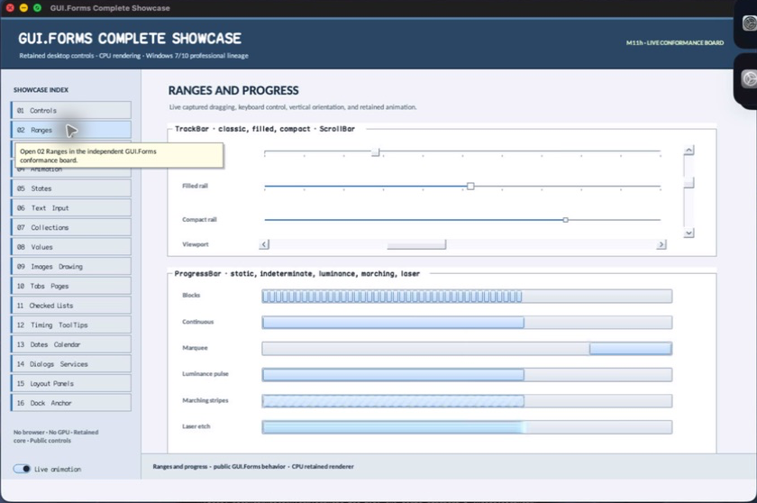

# RangeControl

- Status: **OBSERVED: bundle 004 hierarchical state-machine split; M4 build, focused tests, and Screen Sharing pass**
- Kind: **class / visual retained control**
- Hierarchy: `Control → RangeControl`
- Declaration: `include/gui_forms/controls/range_control/range_control.hpp:33`
- Definition: `src/controls/range_control/range_control.cpp`

RangeControl is the nonvisual retained authority for ordered bounds, constrained value, small/large changes, orientation, compatibility style, normalized projection, typed invalidation, and ordered value/range/scroll events.

## Visual evidence



## Declared methods

### `RangeControl` (public)

```cpp
explicit RangeControl(StableId stable_id)
```

Constructs a focusable range owner with finite default bounds, changes, orientation, and style.

### `minimum` (public)

```cpp
[[nodiscard]] double minimum() const noexcept
```

Returns the inclusive lower bound.

### `maximum` (public)

```cpp
[[nodiscard]] double maximum() const noexcept
```

Returns the inclusive upper bound.

### `value` (public)

```cpp
[[nodiscard]] double value() const noexcept
```

Returns the authoritative value constrained within the current range.

### `small_change` (public)

```cpp
[[nodiscard]] double small_change() const noexcept
```

Returns the positive fine-grained keyboard or line-step magnitude.

### `large_change` (public)

```cpp
[[nodiscard]] double large_change() const noexcept
```

Returns the positive coarse page-step magnitude.

### `orientation` (public)

```cpp
[[nodiscard]] Orientation orientation() const noexcept
```

Returns horizontal or vertical axis policy.

### `normalized_value` (public)

```cpp
[[nodiscard]] double normalized_value() const noexcept
```

Projects the current value to zero through one, handling a degenerate range deterministically.

### `style` (public)

```cpp
[[nodiscard]] const BasicControlStyle& style() const noexcept
```

Returns the explicit BasicControlStyle used by compatibility rendering.

### `set_range` (public)

```cpp
void set_range(double minimum, double maximum)
```

Validates finite ordered bounds, constrains value once, and publishes coherent range then value changes.

### `set_minimum` (public)

```cpp
void set_minimum(double minimum)
```

Updates the lower bound through the atomic range transition.

### `set_maximum` (public)

```cpp
void set_maximum(double maximum)
```

Updates the upper bound through the atomic range transition.

### `set_value` (public)

```cpp
virtual void set_value(double value)
```

Validates finiteness, clamps to bounds, and commits a programmatic value transition.

### `set_small_change` (public)

```cpp
void set_small_change(double change)
```

Accepts a finite positive fine-step magnitude and invalidates semantics.

### `set_large_change` (public)

```cpp
void set_large_change(double change)
```

Accepts a finite positive coarse-step magnitude and invalidates semantics.

### `set_orientation` (public)

```cpp
void set_orientation(Orientation orientation)
```

Validates the closed axis vocabulary and invalidates measure, layout, paint, and semantics.

### `set_style` (public)

```cpp
void set_style(BasicControlStyle style)
```

Commits compatibility colors and invalidates retained appearance.

### `increment` (public)

```cpp
void increment(double delta)
```

Applies a signed delta through the constrained value path using the supplied reason.

### `range_changed` (public)

```cpp
[[nodiscard]] Event<double, double>& range_changed() noexcept
```

Returns the event published after bound state commits.

### `value_changed` (public)

```cpp
[[nodiscard]] Event<double>& value_changed() noexcept
```

Returns the event published after authoritative value commits.

### `scroll` (public)

```cpp
[[nodiscard]] Event<const RangeScrollEvent&>& scroll() noexcept
```

Returns RangeScrollEvent transitions for interactive and semantic movement.

### `local_bounds` (protected)

```cpp
[[nodiscard]] Rect local_bounds() const noexcept
```

Reports the current local bounds value without mutation.

### `set_value_from_input` (protected)

```cpp
bool set_value_from_input(double value, RangeAction action)
```

Synchronously updates the retained value from input property. Validation, typed invalidation, and notifications are defined by the implementation.
