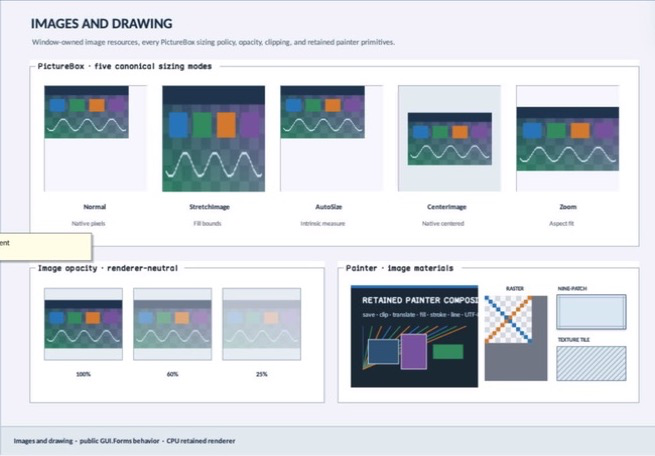

# RasterCanvas

- Status: **OBSERVED: bundle 006 hierarchical move and transparency-cell enhancement; M4 build, focused tests, and Screen Sharing pass**
- Kind: **class / visual retained control**
- Hierarchy: `Control → RasterCanvas`
- Declaration: `include/gui_forms/controls/raster_canvas/raster_canvas.hpp:15`
- Definition: `src/controls/raster_canvas/raster_canvas.cpp`

RasterCanvas is a retained viewport over an application-owned GUI.Drawing Bitmap. It owns resource publication/patch recovery, exact generation tracking, zoom/origin transforms, nearest or linear sampling, bounded background/checker customization, local damage projection, and image semantics; document tools, history, and selection remain outside the control.

## Visual evidence



## Declared methods

### `RasterCanvas` (public)

```cpp
explicit RasterCanvas(StableId stable_id)
```

Constructs a focusable crosshair viewport with nearest sampling and adaptive checker presentation.

### `bitmap` (public)

```cpp
[[nodiscard]] const std::shared_ptr<gui_drawing::Bitmap>& bitmap() const noexcept
```

Returns the shared application-owned bitmap currently presented.

### `set_bitmap` (public)

```cpp
void set_bitmap(std::shared_ptr<gui_drawing::Bitmap> bitmap)
```

Revokes stale Window imagery, replaces the document reference, publishes when attached, and resets generation/error state.

### `clear_bitmap` (public)

```cpp
void clear_bitmap()
```

Removes bitmap presentation through the same resource-revocation path.

### `zoom` (public)

```cpp
[[nodiscard]] double zoom() const noexcept
```

Returns retained bitmap-pixel to client-unit scale.

### `set_zoom` (public)

```cpp
void set_zoom(double zoom)
```

Validates [1/64, 256] and commits zoom with current origin.

### `view_origin` (public)

```cpp
[[nodiscard]] gui_drawing::PointF view_origin() const noexcept
```

Returns the bitmap-space point mapped to client origin.

### `set_view_origin` (public)

```cpp
void set_view_origin(gui_drawing::PointF origin)
```

Validates bounded finite coordinates and commits origin with current zoom.

### `set_view` (public)

```cpp
void set_view(double zoom, gui_drawing::PointF origin)
```

Atomically validates and commits zoom and origin, then refreshes paint and semantics.

### `sampling` (public)

```cpp
[[nodiscard]] ImageSampling sampling() const noexcept
```

Returns nearest or linear image sampling policy.

### `set_sampling` (public)

```cpp
void set_sampling(ImageSampling sampling)
```

Validates admitted sampling and refreshes paint/damage expansion policy.

### `transparency_grid` (public)

```cpp
[[nodiscard]] bool transparency_grid() const noexcept
```

Reports whether transparent bitmap bounds receive a checker backplane.

### `set_transparency_grid` (public)

```cpp
void set_transparency_grid(bool visible)
```

Toggles checker presentation without changing bitmap data.

### `canvas_background` (public)

```cpp
[[nodiscard]] Color canvas_background() const noexcept
```

Returns the viewport color outside visible bitmap bounds.

### `set_canvas_background` (public)

```cpp
void set_canvas_background(Color color)
```

Commits canvas backplane color and invalidates paint.

### `set_transparency_colors` (public)

```cpp
void set_transparency_colors(Color first, Color second)
```

Atomically replaces both checker colors and refreshes paint.

### `transparency_cell_size` (public)

```cpp
[[nodiscard]] double transparency_cell_size() const noexcept
```

Returns explicit checker cell size, or zero for adaptive sizing.

### `set_transparency_cell_size` (public)

```cpp
void set_transparency_cell_size(double size)
```

Accepts zero or a bounded [2, 128] cell size and refreshes paint.

### `presented_generation` (public)

```cpp
[[nodiscard]] std::uint64_t presented_generation() const noexcept
```

Returns the exact Bitmap generation uploaded to the Window resource registry.

### `last_resource_error` (public)

```cpp
[[nodiscard]] ImageResourceError last_resource_error() const noexcept
```

Returns the last image publication or patch error.

### `synchronize_bitmap` (public)

```cpp
[[nodiscard]] bool synchronize_bitmap()
```

Publishes accumulated Bitmap damage as bounded image patches, recovering stale resource IDs by full republish.

### `bitmap_to_client` (public)

```cpp
[[nodiscard]] Rect bitmap_to_client(gui_drawing::RectI pixels) const noexcept
```

Transforms an integer bitmap rectangle through retained origin and zoom.

### `client_to_bitmap` (public)

```cpp
[[nodiscard]] gui_drawing::PointF client_to_bitmap(Point client) const noexcept
```

Transforms a client point back into bitmap-space coordinates.

### `visible_bitmap_bounds` (public)

```cpp
[[nodiscard]] gui_drawing::RectF visible_bitmap_bounds() const
```

Clips the current client viewport to exact bitmap-space bounds.

### `on_paint` (public)

```cpp
void on_paint(Painter& painter, Rect local_damage) override
```

Records canvas, optional checker, and the visible sampled bitmap region.

### `semantic_descriptor` (public)

```cpp
[[nodiscard]] SemanticDescriptor semantic_descriptor() const override
```

Projects image role plus bitmap dimensions and zoom without claiming document editing semantics.

### `on_attached_to_window` (protected)

```cpp
void on_attached_to_window() override
```

Public RasterCanvas operation. Its exact signature is inventoried here; follow the linked implementation for callback order and failure behavior.

### `on_detaching_from_window` (protected)

```cpp
void on_detaching_from_window(Window& former_window) noexcept override
```

Public RasterCanvas operation. Its exact signature is inventoried here; follow the linked implementation for callback order and failure behavior.

### `on_detached_from_window` (protected)

```cpp
void on_detached_from_window() noexcept override
```

Public RasterCanvas operation. Its exact signature is inventoried here; follow the linked implementation for callback order and failure behavior.

### `on_dispose` (protected)

```cpp
void on_dispose() noexcept override
```

Public RasterCanvas operation. Its exact signature is inventoried here; follow the linked implementation for callback order and failure behavior.

### `publish_full_bitmap` (private)

```cpp
[[nodiscard]] bool publish_full_bitmap()
```

Public RasterCanvas operation. Its exact signature is inventoried here; follow the linked implementation for callback order and failure behavior.

### `damage_to_client` (private)

```cpp
[[nodiscard]] Rect damage_to_client(gui_drawing::RectI pixels) const noexcept
```

Reports the current damage to client value without mutation.

### `paint_transparency_grid` (private)

```cpp
void paint_transparency_grid(Painter& painter, Rect bounds) const
```

Reports the current paint transparency grid value without mutation.
