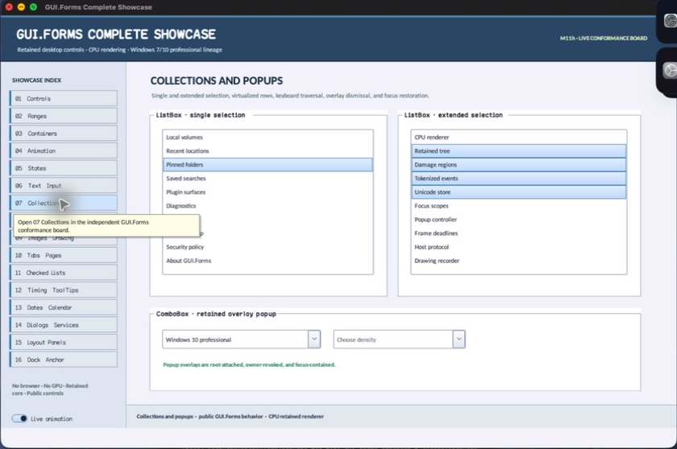

# ScrollableControl

- Status: **OBSERVED: bundle 003 split; M4 build, focused tests, and Screen Sharing pass**
- Kind: **class / visual retained control**
- Hierarchy: `Control → ScrollableControl`
- Declaration: `include/gui_forms/controls/scrollable_control/scrollable_control.hpp:12`
- Definition: `src/controls/scrollable_control/scrollable_control.cpp`

ScrollableControl owns the retained scrolling state machine: overflow discovery, viewport/display rectangles, two axis policies, wheel/button/track/thumb interaction, pointer capture, semantic virtual scrollbars, scroll events, and child exposure.

## Visual evidence



## Declared methods

### `ScrollableControl` (public)

```cpp
explicit ScrollableControl(StableId stable_id)
```

Constructs horizontal and vertical ScrollProperties bound to this owner and enables full-drag behavior by default.

### `auto_scroll` (public)

```cpp
[[nodiscard]] bool auto_scroll() const noexcept
```

Reports whether child/content extent automatically determines scrollbar availability and ranges.

### `set_auto_scroll` (public)

```cpp
virtual void set_auto_scroll(bool enabled)
```

Toggles automatic overflow discovery and invalidates layout, paint, hit testing, and semantics.

### `auto_scroll_margin` (public)

```cpp
[[nodiscard]] Size auto_scroll_margin() const noexcept
```

Returns extra logical extent reserved beyond measured content.

### `set_auto_scroll_margin` (public)

```cpp
void set_auto_scroll_margin(Size margin)
```

Validates finite nonnegative Size or x/y margins, then recomputes overflow and viewport allocation.

### `set_auto_scroll_margin` (public)

```cpp
void set_auto_scroll_margin(double x, double y)
```

Validates finite nonnegative Size or x/y margins, then recomputes overflow and viewport allocation.

### `auto_scroll_min_size` (public)

```cpp
[[nodiscard]] Size auto_scroll_min_size() const noexcept
```

Returns the caller-authored minimum logical content extent.

### `set_auto_scroll_min_size` (public)

```cpp
void set_auto_scroll_min_size(Size size)
```

Validates finite nonnegative dimensions and recomputes the scroll range.

### `auto_scroll_position` (public)

```cpp
[[nodiscard]] Point auto_scroll_position() const noexcept
```

Returns the compatibility projection of position with negative displayed coordinates.

### `set_auto_scroll_position` (public)

```cpp
void set_auto_scroll_position(Point position)
```

Accepts compatibility coordinates, normalizes their sign, and scrolls to the corresponding retained position.

### `scroll_position` (public)

```cpp
[[nodiscard]] Point scroll_position() const noexcept
```

Returns the nonnegative internal content offset.

### `display_rectangle` (public)

```cpp
[[nodiscard]] Rect display_rectangle() const noexcept override
```

Returns the translated content rectangle whose origin reflects the current negative scroll offset.

### `viewport_rectangle` (public)

```cpp
[[nodiscard]] Rect viewport_rectangle() const noexcept
```

Returns the resolved local client viewport after visible scrollbar extents are consumed.

### `horizontal_scroll` (public)

```cpp
[[nodiscard]] const ScrollProperties& horizontal_scroll() const noexcept
```

Returns mutable or const access to the owner-bound horizontal ScrollProperties object.

### `horizontal_scroll` (public)

```cpp
[[nodiscard]] ScrollProperties& horizontal_scroll() noexcept
```

Returns mutable or const access to the owner-bound horizontal ScrollProperties object.

### `vertical_scroll` (public)

```cpp
[[nodiscard]] const ScrollProperties& vertical_scroll() const noexcept
```

Returns mutable or const access to the owner-bound vertical ScrollProperties object.

### `vertical_scroll` (public)

```cpp
[[nodiscard]] ScrollProperties& vertical_scroll() noexcept
```

Returns mutable or const access to the owner-bound vertical ScrollProperties object.

### `hscroll` (public)

```cpp
[[nodiscard]] bool hscroll() const noexcept
```

Reports resolved horizontal scrollbar visibility.

### `vscroll` (public)

```cpp
[[nodiscard]] bool vscroll() const noexcept
```

Reports resolved vertical scrollbar visibility.

### `set_hscroll` (public)

```cpp
void set_hscroll(bool visible)
```

Authors horizontal visibility through the axis model and recomputes the retained scroll layout.

### `set_vscroll` (public)

```cpp
void set_vscroll(bool visible)
```

Authors vertical visibility through the axis model and recomputes the retained scroll layout.

### `get_scroll_state` (public)

```cpp
[[nodiscard]] bool get_scroll_state(std::uint32_t bit) const noexcept
```

Tests one or more documented scroll-state bits without exposing storage.

### `set_scroll_state` (public)

```cpp
void set_scroll_state(std::uint32_t bit, bool value)
```

Commits documented state bits and rejects unknown masks so state-machine vocabulary remains closed.

### `scroll` (public)

```cpp
[[nodiscard]] Event<ScrollEvent&>& scroll() noexcept
```

Returns the event published for requested user/programmatic notifications after position commits.

### `last_scroll_event` (public)

```cpp
[[nodiscard]] std::optional<ScrollEvent> last_scroll_event() const noexcept
```

Returns the most recently published scroll transition, if any.

### `scroll_event_revision` (public)

```cpp
[[nodiscard]] std::uint64_t scroll_event_revision() const noexcept
```

Returns a monotonic publication revision suitable for low-noise inspection.

### `scroll_snapshot` (public)

```cpp
[[nodiscard]] ScrollSnapshot scroll_snapshot() const noexcept
```

Projects the complete retained viewport, content, position, margins, and both axis states as values.

### `scroll_to` (public)

```cpp
bool scroll_to(Point position, ScrollEventType type = ScrollEventType::thumb_position, bool notify = false)
```

Clamps an absolute position, commits changed axes, optionally publishes typed events, and reports whether anything moved.

### `scroll_by` (public)

```cpp
bool scroll_by(Point delta, ScrollEventType horizontal_type = ScrollEventType::small_increment, ScrollEventType vertical_type = ScrollEventType::small_increment, bool notify = false)
```

Applies a delta through the same clamping/event law while preserving independent horizontal and vertical event reasons.

### `scroll_control_into_view` (public)

```cpp
void scroll_control_into_view(const Control::Ptr& control)
```

Validates descendant ownership and computes the minimum bounded motion that exposes the requested child.

### `arrange` (public)

```cpp
void arrange(Rect final_bounds) override
```

Runs ordinary child arrangement, discovers effective content extent, resolves interdependent scrollbar visibility, and commits translated child geometry.

### `on_pointer` (public)

```cpp
void on_pointer(PointerEvent& event) override
```

Owns scrollbar hit parts, primary-pointer capture, thumb dragging, line/page buttons, and terminal end-scroll publication.

### `on_pointer_bubble` (public)

```cpp
void on_pointer_bubble(PointerEvent& event) override
```

Consumes normalized wheel input from descendants and applies bounded axis increments without duplicating handled events.

### `semantic_virtual_children` (public)

```cpp
[[nodiscard]] std::vector<SemanticNode> semantic_virtual_children() const override
```

Exposes active scrollbars as stable semantic range nodes with increment/decrement/set-value actions.

### `on_semantic_child_action` (public)

```cpp
bool on_semantic_child_action(std::string_view stable_id, SemanticAction action, std::string_view value) override
```

Parses a scrollbar virtual-child identity and routes supported semantic range actions through the authoritative axis path.

### `adjust_scrollbars` (protected)

```cpp
virtual void adjust_scrollbars(bool display_scrollbars)
```

Executes ScrollableControl's adjust scrollbars operation against retained state; the signature records its exact inputs, result, constness, and failure surface.

### `scroll_to_control` (protected)

```cpp
[[nodiscard]] virtual Point scroll_to_control(const Control& control) const
```

Reports the current scroll to control value without mutation.

### `set_display_rect_location` (protected)

```cpp
void set_display_rect_location(Point location)
```

Synchronously updates the retained display rect location property. Validation, typed invalidation, and notifications are defined by the implementation.

### `on_paint_overlay` (protected)

```cpp
void on_paint_overlay(Painter& painter, Rect local_damage) override
```

Executes ScrollableControl's on paint overlay operation against retained state; the signature records its exact inputs, result, constness, and failure surface.

### `child_viewport_rectangle` (protected)

```cpp
[[nodiscard]] Rect child_viewport_rectangle() const noexcept override
```

Reports the current child viewport rectangle value without mutation.

### `recompute_scroll_layout` (private)

```cpp
void recompute_scroll_layout(Size client_size)
```

Executes ScrollableControl's recompute scroll layout operation against retained state; the signature records its exact inputs, result, constness, and failure surface.

### `effective_viewport_rectangle` (private)

```cpp
[[nodiscard]] Rect effective_viewport_rectangle() const noexcept
```

Reports the current effective viewport rectangle value without mutation.

### `content_extent` (private)

```cpp
[[nodiscard]] Size content_extent()
```

Executes ScrollableControl's content extent operation against retained state; the signature records its exact inputs, result, constness, and failure surface.

### `maximum_offset` (private)

```cpp
[[nodiscard]] double maximum_offset(ScrollOrientation orientation) const noexcept
```

Reports the current maximum offset value without mutation.

### `axis_geometry` (private)

```cpp
[[nodiscard]] AxisGeometry axis_geometry(ScrollOrientation orientation) const noexcept
```

Reports the current axis geometry value without mutation.

### `part_at` (private)

```cpp
[[nodiscard]] ScrollPart part_at(Point local) const noexcept
```

Reports the current part at value without mutation.

### `handle_wheel` (private)

```cpp
bool handle_wheel(PointerEvent& event)
```

Executes ScrollableControl's handle wheel operation against retained state; the signature records its exact inputs, result, constness, and failure surface.

### `handle_scroll_pointer` (private)

```cpp
bool handle_scroll_pointer(PointerEvent& event)
```

Executes ScrollableControl's handle scroll pointer operation against retained state; the signature records its exact inputs, result, constness, and failure surface.

### `apply_axis_value` (private)

```cpp
bool apply_axis_value(ScrollOrientation orientation, double value, ScrollEventType type, bool notify)
```

Executes ScrollableControl's apply axis value operation against retained state; the signature records its exact inputs, result, constness, and failure surface.

### `notify_scroll` (private)

```cpp
void notify_scroll(ScrollOrientation orientation, ScrollEventType type, double old_value, double new_value)
```

Executes ScrollableControl's notify scroll operation against retained state; the signature records its exact inputs, result, constness, and failure surface.

### `paint_axis` (private)

```cpp
void paint_axis(Painter& painter, ScrollOrientation orientation, const AxisGeometry& geometry) const
```

Reports the current paint axis value without mutation.

### `axis_properties_changed` (private)

```cpp
void axis_properties_changed(ScrollOrientation orientation, bool position_changed)
```

Executes ScrollableControl's axis properties changed operation against retained state; the signature records its exact inputs, result, constness, and failure surface.

### `validate_size` (private)

```cpp
static void validate_size(Size size, const char* message)
```

Executes ScrollableControl's validate size operation against retained state; the signature records its exact inputs, result, constness, and failure surface.

### `validate_axis_value` (private)

```cpp
static void validate_axis_value(double value, const char* message)
```

Executes ScrollableControl's validate axis value operation against retained state; the signature records its exact inputs, result, constness, and failure surface.
