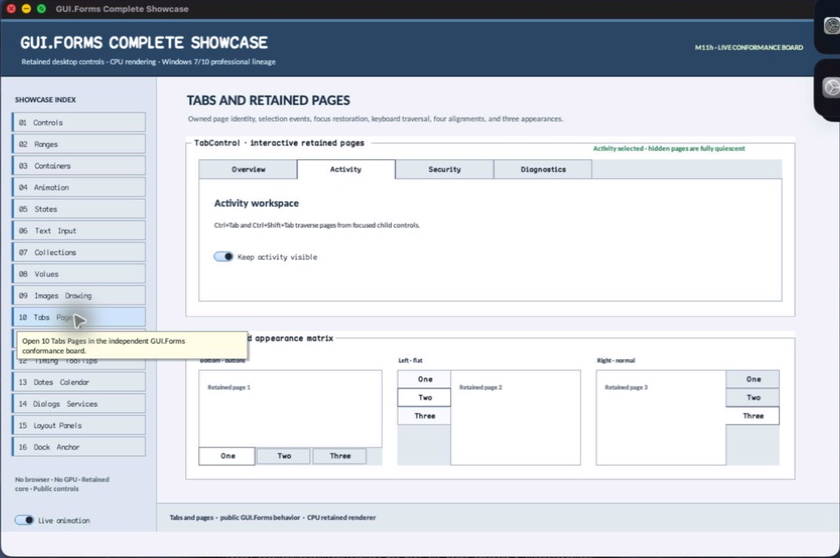

# TabControl

- Status: **OBSERVED: bundle 003 split; M4 build, focused tests, and Screen Sharing pass**
- Kind: **class / visual retained control**
- Hierarchy: `ContainerControl → TabControl`
- Declaration: `include/gui_forms/controls/scrollable_control/container_control/tab_control/tab_control.hpp:34`
- Definition: `src/controls/scrollable_control/container_control/tab_control/tab_control.cpp`

TabControl owns TabPage lifetime, selection, active-page attachment, per-page focus restoration, pointer and keyboard traversal, four header alignments, three appearances, inspectable geometry, and semantic virtual tabs.

## Visual evidence



## Declared methods

### `TabControl` (public)

```cpp
explicit TabControl(StableId stable_id)
```

Constructs a focusable top-aligned normal-appearance page owner with bounded default item size.

### `add_page` (public)

```cpp
void add_page(std::shared_ptr<TabPage> page)
```

Validates nonnull unparented unique TabPage ownership, attaches it, and selects the first page deterministically.

### `remove_page` (public)

```cpp
[[nodiscard]] std::shared_ptr<TabPage> remove_page(const TabPage& page)
```

Detaches and returns the exact page, preserves a nearby selection, and restores focus without leaving hidden descendants active.

### `pages` (public)

```cpp
[[nodiscard]] std::vector<std::shared_ptr<TabPage>> pages() const
```

Returns a live strong snapshot in retained page order after expired references are excluded.

### `page_count` (public)

```cpp
[[nodiscard]] std::size_t page_count() const
```

Returns the number of live owned pages.

### `page_at` (public)

```cpp
[[nodiscard]] std::shared_ptr<TabPage> page_at(std::size_t index) const
```

Returns the live page at a validated retained index.

### `selected_index` (public)

```cpp
[[nodiscard]] std::optional<std::size_t> selected_index() const
```

Returns the live selected page index or no value when the control is empty.

### `selected_tab` (public)

```cpp
[[nodiscard]] std::shared_ptr<TabPage> selected_tab() const noexcept
```

Returns the selected live TabPage or null when none remains.

### `set_selected_index` (public)

```cpp
void set_selected_index(std::size_t index)
```

Validates index and changes selection through the focus-memory, visibility, event, and invalidation law.

### `set_selected_tab` (public)

```cpp
void set_selected_tab(const std::shared_ptr<TabPage>& page)
```

Requires an owned live page and changes selection through the same authoritative path.

### `alignment` (public)

```cpp
[[nodiscard]] TabAlignment alignment() const noexcept
```

Returns top, bottom, left, or right header-strip placement.

### `set_alignment` (public)

```cpp
void set_alignment(TabAlignment alignment)
```

Validates alignment vocabulary and invalidates geometry, rendering, hit testing, and semantics.

### `appearance` (public)

```cpp
[[nodiscard]] TabAppearance appearance() const noexcept
```

Returns normal tabs, buttons, or flat-buttons rendering policy.

### `set_appearance` (public)

```cpp
void set_appearance(TabAppearance appearance)
```

Validates appearance vocabulary and invalidates style, paint, and semantics.

### `item_size` (public)

```cpp
[[nodiscard]] Size item_size() const noexcept
```

Returns the logical header width and height applied to each tab.

### `set_item_size` (public)

```cpp
void set_item_size(Size size)
```

Accepts finite bounded positive dimensions and invalidates measure/arrangement/paint/hit testing.

### `style` (public)

```cpp
[[nodiscard]] const BasicControlStyle& style() const noexcept
```

Returns the explicit BasicControlStyle used for header and frame painting.

### `set_style` (public)

```cpp
void set_style(BasicControlStyle style)
```

Validates and commits compatibility colors before invalidating visual and semantic state.

### `tab_bounds` (public)

```cpp
[[nodiscard]] Rect tab_bounds(std::size_t index) const
```

Returns the local header rectangle for a validated page index under current alignment.

### `display_bounds` (public)

```cpp
[[nodiscard]] Rect display_bounds() const noexcept
```

Returns the local rectangle assigned to the selected page after the header strip is removed.

### `selected_index_changed` (public)

```cpp
[[nodiscard]] Event<const TabSelectionChange&>& selected_index_changed() noexcept
```

Returns the event published after old-page focus is remembered and new-page selection commits.

### `measure` (public)

```cpp
[[nodiscard]] Size measure(Size available) override
```

Combines the largest live page demand with orientation-aware header-strip extent.

### `arrange` (public)

```cpp
void arrange(Rect final_bounds) override
```

Reconciles page ownership, assigns only the selected page to display bounds, and keeps inactive pages quiescent.

### `on_paint` (public)

```cpp
void on_paint(Painter& painter, Rect local_damage) override
```

Records the tab frame, all headers, selected/focused cues, captions, and current appearance.

### `on_pointer` (public)

```cpp
void on_pointer(PointerEvent& event) override
```

Tracks primary-pointer engagement and selects the released header only when the gesture remains qualified.

### `on_key_preview` (public)

```cpp
void on_key_preview(KeyEvent& event) override
```

Handles Control-Tab traversal and orientation-aware arrow selection before descendant dispatch.

### `on_focus_changed` (public)

```cpp
void on_focus_changed(bool focused) override
```

Commits the header focus cue and restores selected-page focus when appropriate.

### `semantic_descriptor` (public)

```cpp
[[nodiscard]] SemanticDescriptor semantic_descriptor() const override
```

Projects the owner as a tab list with selected-page value.

### `semantic_virtual_children` (public)

```cpp
[[nodiscard]] std::vector<SemanticNode> semantic_virtual_children() const override
```

Exposes each live page header as a stable selectable tab semantic node.

### `on_semantic_child_action` (public)

```cpp
bool on_semantic_child_action(std::string_view stable_id, SemanticAction action, std::string_view value) override
```

Maps a virtual tab select/press action to the owned page selection path.

### `index_of` (private)

```cpp
[[nodiscard]] std::optional<std::size_t> index_of( const std::shared_ptr<TabPage>& page) const
```

Reports the current index of value without mutation.

### `select_relative` (private)

```cpp
void select_relative(int delta)
```

Executes TabControl's select relative operation against retained state; the signature records its exact inputs, result, constness, and failure surface.

### `remember_page_focus` (private)

```cpp
void remember_page_focus(const std::shared_ptr<TabPage>& page)
```

Executes TabControl's remember page focus operation against retained state; the signature records its exact inputs, result, constness, and failure surface.

### `restore_page_focus` (private)

```cpp
void restore_page_focus(const std::shared_ptr<TabPage>& page, bool selection_owned_focus)
```

Executes TabControl's restore page focus operation against retained state; the signature records its exact inputs, result, constness, and failure surface.

### `reconcile_pages` (private)

```cpp
void reconcile_pages()
```

Executes TabControl's reconcile pages operation against retained state; the signature records its exact inputs, result, constness, and failure surface.
