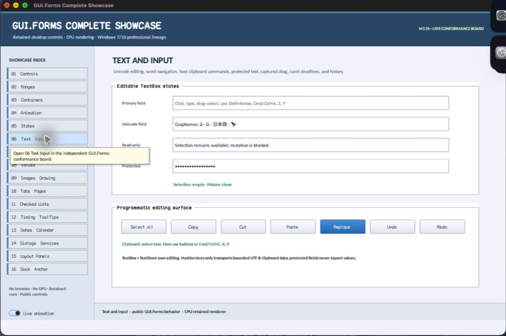

# TextBox

- Status: **OBSERVED: bundle 004 split and maximum-length enhancement; M4 build, focused tests, and Screen Sharing pass**
- Kind: **class / visual retained control**
- Hierarchy: `Panel → TextBox`
- Declaration: `include/gui_forms/controls/panel/text_box/text_box.hpp:35`
- Definition: `src/controls/panel/text_box/text_box.cpp`

TextBox is a retained single-line Unicode editor with scalar-safe navigation, directional selection, clipboard/history commands, password projection, bounded user-input length, caret animation, semantic editing, and ordered text/selection events.

## Visual evidence



## Declared methods

### `TextBox` (public)

```cpp
explicit TextBox(StableId stable_id, std::string text =
```

Constructs a focusable text editor with I-beam cursor, text-input intent, and retained caret state.

### `text` (public)

```cpp
[[nodiscard]] std::string_view text() const noexcept
```

Returns the authoritative unmasked UTF-8 value.

### `set_text` (public)

```cpp
void set_text(std::string text)
```

Validates UTF-8, replaces the value programmatically, clears edit history, constrains selection, and publishes changed state.

### `placeholder_text` (public)

```cpp
[[nodiscard]] std::string_view placeholder_text() const noexcept
```

Returns the hint rendered only while the authoritative value is empty.

### `set_placeholder_text` (public)

```cpp
void set_placeholder_text(std::string text)
```

Commits hint text and invalidates paint without entering it into the value model.

### `read_only` (public)

```cpp
[[nodiscard]] bool read_only() const noexcept
```

Reports whether user-originated mutations are rejected while selection and copy remain available.

### `set_read_only` (public)

```cpp
void set_read_only(bool read_only)
```

Toggles the user-edit gate and refreshes paint and semantics.

### `maximum_length` (public)

```cpp
[[nodiscard]] std::size_t maximum_length() const noexcept
```

Returns the maximum admitted Unicode scalar count for user edits, or zero for unlimited.

### `set_maximum_length` (public)

```cpp
void set_maximum_length(std::size_t length)
```

Accepts zero or a bounded scalar limit, constrains future user edits, and leaves programmatic assignment explicit.

### `password_character` (public)

```cpp
[[nodiscard]] char32_t password_character() const noexcept
```

Returns the explicit masking scalar, or an empty value when none is selected.

### `set_password_character` (public)

```cpp
void set_password_character(char32_t character)
```

Validates a single UTF-8 scalar and updates masked display without changing authoritative text.

### `use_system_password_character` (public)

```cpp
[[nodiscard]] bool use_system_password_character() const noexcept
```

Reports whether the platform-neutral default bullet masks displayed text.

### `set_use_system_password_character` (public)

```cpp
void set_use_system_password_character(bool enabled)
```

Toggles default password masking and invalidates visual and semantic projection.

### `password_protected` (public)

```cpp
[[nodiscard]] bool password_protected() const noexcept
```

Reports whether either explicit or system masking policy is active.

### `font` (public)

```cpp
[[nodiscard]] FontSpec font() const noexcept
```

Returns the retained editor FontSpec.

### `set_font` (public)

```cpp
void set_font(FontSpec font)
```

Validates typography, then invalidates measurement, paint, and caret geometry.

### `selection` (public)

```cpp
[[nodiscard]] TextSelection selection() const noexcept
```

Returns directional anchor and active UTF-8 byte boundaries.

### `select` (public)

```cpp
void select(Utf8Offset anchor, Utf8Offset caret)
```

Validates and normalizes requested byte boundaries against Unicode scalar edges.

### `select_all` (public)

```cpp
void select_all()
```

Selects the complete authoritative byte range.

### `selected_text` (public)

```cpp
[[nodiscard]] std::string selected_text() const
```

Returns the authoritative unmasked substring within the normalized selection.

### `can_undo` (public)

```cpp
[[nodiscard]] bool can_undo() const noexcept
```

Reports whether an earlier text-and-selection snapshot is available.

### `can_redo` (public)

```cpp
[[nodiscard]] bool can_redo() const noexcept
```

Reports whether a reverted snapshot remains available.

### `undo` (public)

```cpp
bool undo()
```

Restores the previous snapshot, records the current snapshot for redo, and publishes coherent changes.

### `redo` (public)

```cpp
bool redo()
```

Reapplies the next snapshot, restores undo continuity, and publishes coherent changes.

### `replace_selection` (public)

```cpp
bool replace_selection(std::string_view replacement)
```

Validates UTF-8, enforces the user maximum-length law, and replaces the selected range as one undoable edit.

### `delete_selection` (public)

```cpp
bool delete_selection()
```

Removes the selected range as one undoable user edit when mutation is allowed.

### `copy` (public)

```cpp
bool copy()
```

Publishes selected unmasked text to the attached Window clipboard unless password policy forbids disclosure.

### `cut` (public)

```cpp
bool cut()
```

Copies then removes selection through the normal mutation path when editing is allowed.

### `paste` (public)

```cpp
bool paste()
```

Reads attached Window clipboard text and applies it through validation and maximum-length enforcement.

### `text_changed` (public)

```cpp
[[nodiscard]] Event<const std::string&>& text_changed() noexcept
```

Returns the event published after authoritative text commits.

### `selection_changed` (public)

```cpp
[[nodiscard]] Event<const TextSelection&>& selection_changed() noexcept
```

Returns the event published after directional selection commits.

### `committed` (public)

```cpp
[[nodiscard]] Event<const std::string&>& committed() noexcept
```

Returns the event published by Enter or the corresponding semantic action.

### `cancelled` (public)

```cpp
[[nodiscard]] Event<>& cancelled() noexcept
```

Returns the event published by Escape.

### `on_paint` (public)

```cpp
void on_paint(Painter& painter, Rect local_damage) override
```

Records background, border, clipped placeholder or projected text, selection highlight, and blinking caret.

### `on_pointer` (public)

```cpp
void on_pointer(PointerEvent& event) override
```

Owns click/drag selection with capture, scalar-safe hit testing, and focus acquisition.

### `on_key` (public)

```cpp
void on_key(KeyEvent& event) override
```

Implements scalar/word navigation, extension, deletion, clipboard commands, history, commit, and cancel.

### `on_text_input` (public)

```cpp
void on_text_input(TextInputEvent& event) override
```

Applies validated text input through the common selection-replacement and history state machine.

### `on_focus_changed` (public)

```cpp
void on_focus_changed(bool focused) override
```

Starts or stops caret animation and resets the visible focus phase.

### `on_frame` (public)

```cpp
void on_frame(FrameTime now) override
```

Advances the retained caret blink deadline only while focused and editable.

### `semantic_descriptor` (public)

```cpp
[[nodiscard]] SemanticDescriptor semantic_descriptor() const override
```

Projects an editable or read-only text role, value policy, selection metadata, and supported actions without leaking passwords.

### `on_semantic_action` (public)

```cpp
bool on_semantic_action(SemanticAction action, std::string_view value) override
```

Routes focus, set-value, selection, clipboard, history, commit, and cancel actions through normal editor laws.

### `on_detached_from_window` (protected)

```cpp
void on_detached_from_window() noexcept override
```

Executes TextBox's on detached from window operation against retained state; the signature records its exact inputs, result, constness, and failure surface.

### `snapshot` (private)

```cpp
[[nodiscard]] Snapshot snapshot() const
```

Reports the current snapshot value without mutation.

### `apply_snapshot` (private)

```cpp
void apply_snapshot(Snapshot snapshot)
```

Executes TextBox's apply snapshot operation against retained state; the signature records its exact inputs, result, constness, and failure surface.

### `set_selection` (private)

```cpp
void set_selection(TextSelection selection, bool reveal_caret = true)
```

Synchronously updates the retained selection property. Validation, typed invalidation, and notifications are defined by the implementation.

### `replace` (private)

```cpp
bool replace(Utf8Offset start, Utf8Offset end, std::string_view replacement, bool record_history = true)
```

Executes TextBox's replace operation against retained state; the signature records its exact inputs, result, constness, and failure surface.

### `position_at` (private)

```cpp
[[nodiscard]] Utf8Offset position_at(double local_x) const noexcept
```

Reports the current position at value without mutation.

### `boundary_x` (private)

```cpp
[[nodiscard]] double boundary_x(Utf8Offset offset) const noexcept
```

Reports the current boundary x value without mutation.

### `previous_word_boundary` (private)

```cpp
[[nodiscard]] Utf8Offset previous_word_boundary(Utf8Offset offset) const
```

Reports the current previous word boundary value without mutation.

### `next_word_boundary` (private)

```cpp
[[nodiscard]] Utf8Offset next_word_boundary(Utf8Offset offset) const
```

Reports the current next word boundary value without mutation.

### `display_text` (private)

```cpp
[[nodiscard]] std::string display_text() const
```

Reports the current display text value without mutation.

### `reset_caret_blink` (private)

```cpp
void reset_caret_blink()
```

Returns caret blink to its inherited or default policy.

### `schedule_caret_blink` (private)

```cpp
void schedule_caret_blink()
```

Executes TextBox's schedule caret blink operation against retained state; the signature records its exact inputs, result, constness, and failure surface.

### `push_history` (private)

```cpp
void push_history(std::deque<Snapshot>& history, Snapshot snapshot)
```

Executes TextBox's push history operation against retained state; the signature records its exact inputs, result, constness, and failure surface.

### `clear_redo` (private)

```cpp
void clear_redo() noexcept
```

Removes the explicit redo value and restores fallback behavior.
