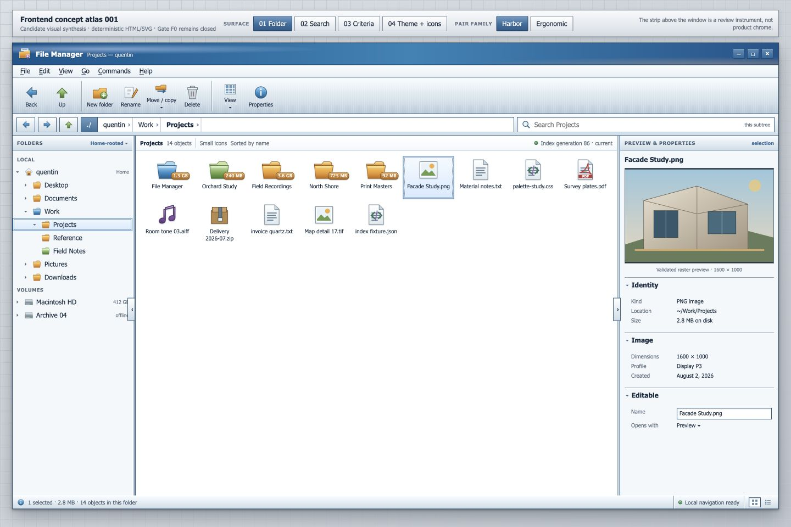
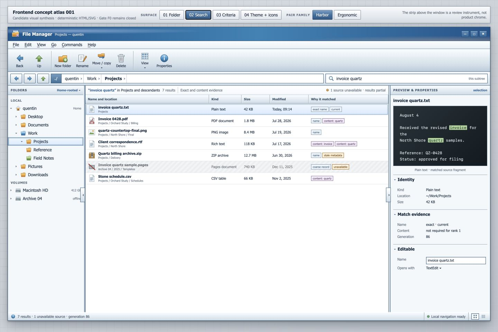
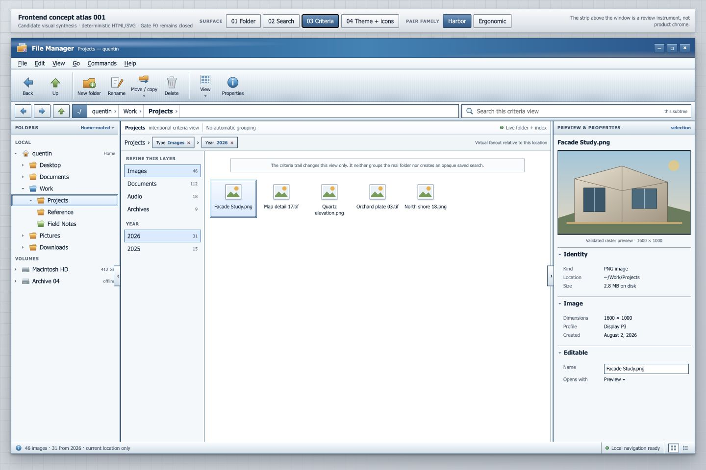
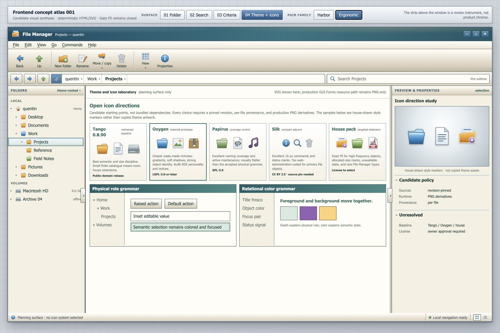

# Demoboard reference evidence

Date copied: 2026-08-05

The files in this directory are frozen visual/source evidence for the native
demoboard. They are not runtime dependencies and are not permission to embed a
browser engine.

## Manifest

| File | SHA-256 | Meaning |
|---|---|---|
| `frontend-concept-atlas-reference.html` | `aeab8bd4796ef05403d0cc3845cc4800a417fcde0a50fed9d3e1a2fe031021f7` | latest copied atlas source; exact geometry, tokens, fixture copy, and prototype interactions |
| `screenshots/folder-reference.jpg` | `44f8c04762435cb172c4243f3240ed3e3a4f9a13331b5411f72c78cd8ba42754` | historical 1440×960 folder composition capture |
| `screenshots/search-reference.jpg` | `4ff962cd3fb434e421404ef7e1cd1cca1752b571ef8c01e14b55badd829af851` | historical 1440×960 search composition capture |
| `screenshots/criteria-reference.jpg` | `76405025f501a77748f79b604ec69077b53d86993fbf46c13b4fb64fde95802a` | historical 1440×960 criteria composition capture |
| `screenshots/theme-icons-reference.jpg` | `105637da873b46263c31cbf860d46e112b4b4fdc44df14c7efea5301d8e42e85` | historical 1440×960 theme/icon study capture |

## Screenshots

### Folder

### Search

### Criteria virtual folder

### Theme and icon study

## Precedence and known deltas

The screenshots predate several owner corrections. They preserve composition,
density, depth, and relative geometry; they are not literal authority where the
current HTML and specifications differ.

Implement these corrections over the screenshots:

1. The navigation terminal `./` is the final element inside the breadcrumb
   well, immediately before the separate search well. It is not the first
   breadcrumb.
2. Activating `./` opens the drive-rooted path matrix with the current full
   stack plus five recent full stacks. Common roots intentionally repeat.
3. Activating the open tail after the last current breadcrumb converts that
   stack directly into a terminal-like path editor with autocomplete.
4. Remove the redundant content header that repeated object count, icon size,
   sort, and index information. Sort belongs in the ribbon; counts, index, and
   local navigation authority belong in the bottom status line.
5. The selection pane is titled by its subject (`Selection`), not by the word
   `Preview`. Preview is one region within the pane.
6. Search has no right preview pane. Each result is a compact correspondence
   row that expands on hover/focus and can be pinned. Its expanded body contains
   a small inline excerpt, match percentage, factual metadata, and a distinct
   plugin-information lane.
7. Search match criteria are a metadata string with marked substrings, not a
   row of colorful criterion tags. Plugin-provided semantic indications may use
   restrained tags only inside the plugin-information lane.
8. Criteria remains a virtual folder and therefore retains selection preview
   and properties. Its predicate rack is the current target, replacing the
   older left-facet draft visible in the historical screenshot.
9. The structural chassis below the ribbon is subtle middle-value graphite with
   sub-3% directional texture and thin three-pixel seams, never black bars.
10. Default styling is Sapphire Dusk plus House Composite: Watercolor identity,
    Office Pearl/Watercolor above, Workshop chassis below, Studio 2003
    information panes.
11. The review strip visible above historical captures is demoboard
    instrumentation. In the native project it becomes the separate Demoboard
    Controller and is excluded from product-window captures.

## How to use the HTML reference

Read it to extract:

- stable copy and fixture values;
- the 1450×850 reference grid;
- Sapphire and alternate atmosphere tokens;
- House Composite and alternate construction recipes;
- the path-matrix interaction;
- result expansion dimensions;
- criteria-module structure;
- review-laboratory content;
- and Design DNA decision specimens.

Do not:

- execute it inside the native demoboard;
- copy CSS into an embedded web view;
- treat browser font metrics as native goldens;
- use its inline SVG at runtime;
- or preserve a historical screenshot defect over a later owner verdict.
